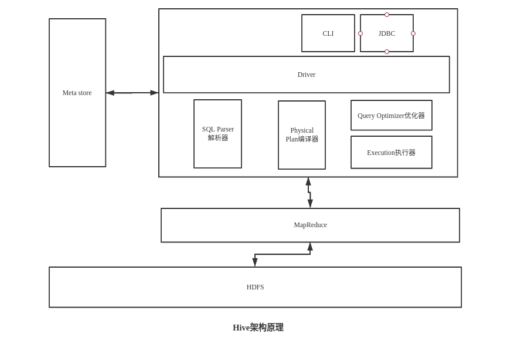

# 一、Hive基本概念

### 1.1、什么是Hive

Hive：由Facebook开源用于海量结构化日志的数据统计（Hive是分析框架，它不能存储数据的）

Hive是基于Hadoop的一个**数据仓库工具**，可以将**结构化的数据文件映射为一张表**，并提供**类SQL**查询功能。

**本质：将HQL转化成MapReduce程序**

- 数据仓库通过SQL进行统计分析
- 将SQL语言中常用的操作（select,where,group等）用MapReduce写成很多模板
- 所有的MapReduce模板封装在Hive中
- client客户端，用户根据业务需求编写相应的SQL语句
- 然后会去Hive中找对应的MapReduce模板
- 通过Hive框架匹配出相应的MapReduce模板
- 运行MapReduce程序，生成相应的分析结果

Hive可以看做是Hadoop的客户端，装一个就够了啊，Hive它有不存储数据，不做计算，它就将HQL转化为MapReduce

Hive处理的数据存储在HDFS

Hive分析数据底层的实现是MapReduce

执行程序运行在Yarn上

### 1.2、Hive的优缺点

#### 1.2.1、优点

- 操作接口采用类SQL语法，提供快速开发的能力（简单，容易上手）

- 避免了去写MapReduce，减少开发人员得 学习成本

- HIve的执行延迟比较高，因此HIve常用数据分析，对实时性要求不高的场合

  比如你凌晨一两点，启动一个定时脚本，跑一下数据，实时性不高，不是那种你来一条数据，就立马处理的那种，就是说它可以处理，但是给反馈，交互出结果比较慢，因为它跑MR，而MR整个启动，提交啊，切片啊非常的慢，所以它应用的场景一般是离线

- Hive优势在于处理大数据，对于处理小数据没有优势，因为Hive的执行延迟比较高，启动太慢

- Hive支持用户自定义函数，用户可以根据自己的需求来实现自己的函数

#### 1.2.2、缺点

##### 1、Hive的HQL表达能力有限

- 迭代式算法无法表达
- 数据挖掘方面不擅长

##### 2、Hive的效率比较低

- Hive自动生成的MapReduce作业，通常情况下不够智能化
- Hive调优比较困难，粒度比较粗

### 1.3、Hive架构原理



CLI：命令行接口，以命令行的形式输入SQL语句进行数据操作，有点类似shell

Meta store：元数据存储，就是存的是表跟数据之间的位置对应关系，有点类似索引，Hive不会存储Meta store，会存在mysql或者Derby中

Meta store作用：客户端连接Meta store服务，Meta store再去连接Mysql数据库来存取元数据，有了Meta store服务，就可以有多个客户端可以同时连接，而切这些客户端不需要知道MySQL的数据库用户名和密码，只需要连接Meta store服务就行。

因为Meta store的元数据不断的修改，更新，所以Hive元数据不适合存在HDFS中，一般存在RDBMS中

HIve没有专门的数据存储格式，也没有为数据建立索引，Hive中所有数据都存储在HDFS中

### 1.4、使用Hive

- 直接使用MapReduce的问题：

  - 人员学习成本太高
  - 项目周期要求太短
  - MapReduce实现复杂查询逻辑的开发难度太大

- 使用Hive

  - 更友好的接口：操作借口采用类SQL的语法，快速开发能力
  - 学习成本低：避免了写MapReduce，减少开发学习成本
  - 更好的扩展性：可自由扩展集群规模而不需要重启服务，用于还可以自定义函数

- Hive使用场景

  - Hive与传统的关系型SQL不同，支持绝大多数的语句DDL，DML以及聚集函数，连接查询，条件查询。
  - Hive不适合联机事务处理，不提供实时查询功能，适用于基于大量不可变的批处理作业。

- Hive的使用

  - 不支持Insert into，Update，Delete操作

  - 不支持等值连接

    ```sql
    select * from table a,table b where a.id=b.id;
    /*Hive中*/
    select * from table a join table b on a.id=b.id;
    ```


### 1.5、HiveQL

```sql
--Hive是一种数据库技术，可以定义数据库和表来分析结构化数据。
--主题结构化数据分析是以表方式存储数据，并通过查询来分析。
--创建数据库是用来创建
create schema test;

--------------------------------------------------------------Hive分区-------------------------------------------------------------------------------------
--Hive组织表到分区，它是将一个表到基于分区列，如日期，城市和部门的值相关方式。使用分区，很容易对数据进行部分查询
--表或者分区是细分成桶，以提供额外的结构，可以使用更高效的查询的数据，桶的工作是基于表的一些列的散列函数值。
--添加分区
alter table table_name add PARTITION partition_spec
-- 重命名分区
alter table table_name PARTITION partition_spec RENAME TO PARTITION partition_new;
--删除分区
alter table table_name DROP PARTITION partition_spec,PARTITION partition_new

-----------------------------------------------------------------Hive聚合函数-----------------------------------------------------------------------------
--Hive支持以下内置聚合函数，用法类似SQL聚合函数
--1、count(*)返回检索行的总数:return type: BIGINT
select count(*) from table_name;
--2、sum(col_name),sum(DISTINCT col_name):返回该组或者该组中的列的不同值的分组和所有元素的总和;return type:DOUBLE
select sum(comm_id) from table_name group by comm_id;
--3、avg(col_name),avg(DISTINCT col_name):返回组或者组中列的不同值的元素的平均值，return type:DOUBLE
select avg(score) from table_name group by score;
--4、min(col_name):返回该组中的列的最小值，return type :DOUBLE
--5、max(col_name)：返回该组中的列的最大值,return type:DOUBLE


-----------------------------------------------------------------------------Hive的视图和索引----------------------------------------------------------
--根据用户的需求可以创建视图，可以将任何结果集数据保存为一个视图，视图在Hive的用法和SQL视图用法相同，他是一个标准的
--RDBMS概念，可以在视图上执行所有的DML操作。
--1、创建一个视图，可以创建一个视图，在执行SELECT语句的时候
create VIEW view_name AS SELECT * from table where cal_dat="201907"and salary>3000;
--2、删除一个视图
DROP VIEW view_name;
--3、创建索引
--索引也就是一个表上的一个特定列的指针，创建索引意味着创建一个表上的一个特定列的指针。
CREATE INDEX index_name ON TABLE table_name(salary)
AS 'org.apache.hadoop.hive.sql.index.compack.CompactIndexHandler';
--4、删除索引
DROP INDEX index_name on table_name;

------------------------------------------------------------------------------Hive的Select Where-------------------------------------------------------
--1、select的单查询
SELECT * FROM table_name WHERE salay>2000;
--2、select的order by查询
SELECT id,score,name from table_name ORDER BY score;
--3、select的group by查询
SELECT dept,count(*) from table_name GROUP BY dept;
--4、select的join查询,有点类似SQL的inner join
SELECT a.id,b.name,a,score FROM user_tab join score_tab b
ON a.id=b.id;
--5、select的left outer join查询，以左表为核心，返回左表所有的行，右表没匹配的给null
--6、select的right outer join查询，以右表为核心，返回右表所有的行，左表没匹配的列给null
--7、select的full outer join查询，连接表包含两个表所有的记录，如果两侧缺少匹配的给null

--查看表结构以及字段
desc hdp_drq_dw_db.test;
--查看表的分区字段以及值
show PARTITIONS hdp_drq_dw_db.test;
```

