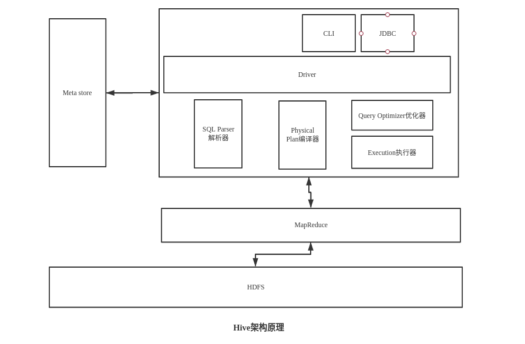

# Hive基本概念

### 1.1、什么是Hive

Hive：由Facebook开源用于海量结构化日志的数据统计（Hive是分析框架，它不能存储数据的）

Hive是基于Hadoop的一个**数据仓库工具**，可以将**结构化的数据文件映射为一张表**，并提供**类SQL**查询功能。

**本质：将HQL转化成MapReduce程序**

- 数据仓库通过SQL进行统计分析
- 将SQL语言中常用的操作（select,where,group等）用MapReduce写成很多模板
- 所有的MapReduce模板封装在Hive中
- client客户端，用户根据业务需求编写相应的SQL语句
- 然后会去Hive中找对应的MapReduce模板
- 通过Hive框架匹配出相应的MapReduce模板
- 运行MapReduce程序，生成相应的分析结果

Hive可以看做是Hadoop的客户端，装一个就够了啊，Hive它有不存储数据，不做计算，它就将HQL转化为MapReduce

Hive处理的数据存储在HDFS

Hive分析数据底层的实现是MapReduce

执行程序运行在Yarn上

### 1.2、Hive的优缺点

#### 1.2.1、优点

- 操作接口采用类SQL语法，提供快速开发的能力（简单，容易上手）

- 避免了去写MapReduce，减少开发人员得 学习成本

- HIve的执行延迟比较高，因此HIve常用数据分析，对实时性要求不高的场合

  比如你凌晨一两点，启动一个定时脚本，跑一下数据，实时性不高，不是那种你来一条数据，就立马处理的那种，就是说它可以处理，但是给反馈，交互出结果比较慢，因为它跑MR，而MR整个启动，提交啊，切片啊非常的慢，所以它应用的场景一般是离线

- Hive优势在于处理大数据，对于处理小数据没有优势，因为Hive的执行延迟比较高，启动太慢

- Hive支持用户自定义函数，用户可以根据自己的需求来实现自己的函数

#### 1.2.2、缺点

##### 1、Hive的HQL表达能力有限

- 迭代式算法无法表达
- 数据挖掘方面不擅长

##### 2、Hive的效率比较低

- Hive自动生成的MapReduce作业，通常情况下不够智能化
- Hive调优比较困难，粒度比较粗

### 1.3、Hive架构原理

CLI：命令行接口，以命令行的形式输入SQL语句进行数据操作，有点类似shell

Meta store：元数据存储，就是存的是表跟数据之间的位置对应关系，有点类似索引，Hive不会存储Meta store，会存在mysql或者Derby中

Meta store作用：客户端连接Meta store服务，Meta store再去连接Mysql数据库来存取元数据，有了Meta store服务，就可以有多个客户端可以同时连接，而切这些客户端不需要知道MySQL的数据库用户名和密码，只需要连接Meta store服务就行。

因为Meta store的元数据不断的修改，更新，所以Hive元数据不适合存在HDFS中，一般存在RDBMS中

HIve没有专门的数据存储格式，也没有为数据建立索引，Hive中所有数据都存储在HDFS中

