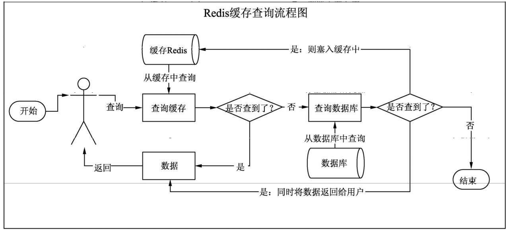

# 一、Redis实战之场景1：缓存穿透

### 1、正常流程

​		项目中使用缓存Redis查询数据的正常流程，如下图



- 前端用户要访问获取数据时，后端首先会在Redis中查询
- 如果能查询到数据，则直接将数据返回给用户，流程结束
- 如果查不到数据，就前往数据库中查询，如果能查到数据，将数据返回给用户，同时将数据塞入缓存Redis中，流程结束
- 如果在数据库中没有查询到数据，则返回null，同时流程结束。

### 2、问题分析

​		当查询数据库的时候如果没有查询到数据，就直接返回null给前端用户，流程结束，如果前端频繁发起访问请求，恶意提供数据库中不存在的Key，则此时数据库中查询到的数据永远为null。由于null数据是不存入到Redis中，所以每次访问请求时将查询数据库，如果此时有恶意攻击，发起“洪流”式的查询，则很有可能会对数据库造成极大的压力，甚至压垮数据库。这个叫缓存穿透，就好像永远越过了缓存而直接永远的访问数据库。

### 3、解决方案

​		当查询数据库时，如果没有查询到数据，将null返回给前端用户，同时将该null数据塞入Redis，并对对应的Key设置一定的过期时间，流程结束，具体过程如下图


### 4、实战过程

#### 1、建立数据库连接

```properties
#redis
#spring.redis.database=0
spring.redis.host=localhost
spring.redis.port=6379
#spring.redis.password=
#spring.redis.jedis.pool.max-active=8
#spring.redis.jedis.pool.max-wait=-1
#spring.redis.jedis.pool.max-idle=8
#spring.redis.lettuce.pool.min-idle=0
#spring.redis.timeout=1000
server.port=8080
#mysql
spring.jpa.show-sql=true
spring.datasource.url=jdbc:mysql://localhost/victor
spring.datasource.username=root
spring.datasource.password=root
spring.datasource.driver-class-name=com.mysql.jdbc.Driver
```

#### 2、引入依赖

```xml
<!--			jpa-->
<dependency>
            <groupId>org.springframework.boot</groupId>
            <artifactId>spring-boot-starter-data-jpa</artifactId>
        </dependency>
<!--            lombok-->
        <dependency>
            <groupId>org.projectlombok</groupId>
            <artifactId>lombok</artifactId>
            <optional>true</optional>
        </dependency>
<!--        redis-->
        <dependency>
            <groupId>org.springframework.boot</groupId>
            <artifactId>spring-boot-starter-data-redis</artifactId>
        </dependency>
```

#### 3、实体类Person

```java
package com.victor.model;

import com.fasterxml.jackson.annotation.JsonFormat;
import lombok.Data;
import lombok.ToString;

import javax.persistence.*;
import java.io.Serializable;
import java.util.Date;

/**
 * @Description:
 * 使用JPA查询必须要有@Entity和@Table两个注解，否则报错
 * @Author: VictorDan
 * @Version: 1.0
 */
@Data
@ToString
@Table(name = "person")
@Entity
public class Person implements Serializable {
    @Id
    @GeneratedValue(strategy = GenerationType.IDENTITY)
    @Column(name = "id")
    private Integer id;
    private String userName;
    private String password;
    @JsonFormat(pattern = "yyyy-MM-dd HH:mm:ss",timezone = "GMT+8")
    private Date createTime;
    private String status;
}
```

#### 4、操作数据库的PersonRepository

```java
package com.victor.repository;

import com.victor.model.Person;
import org.springframework.data.jpa.repository.JpaRepository;
import org.springframework.stereotype.Repository;

import java.util.List;

/**
 * @Description:
 * @Author: VictorDan
 * @Version: 1.0
 */
@Repository
public interface PersonRepo extends JpaRepository<Person,Long> {
    Person findByUserName(String name);
}

```

#### 5、操作Redis的CachePersonService

```java
package com.victor.service;

import com.fasterxml.jackson.databind.ObjectMapper;
import com.victor.model.Person;
import com.victor.repository.PersonRepo;
import lombok.extern.slf4j.Slf4j;
import org.springframework.beans.factory.annotation.Autowired;
import org.springframework.data.redis.core.RedisTemplate;
import org.springframework.data.redis.core.ValueOperations;
import org.springframework.stereotype.Service;

import java.util.concurrent.TimeUnit;

/**
 * @Description: 缓存穿透实战Controller
 * @Author: VictorDan
 * @Version: 1.0
 */
@Service
@Slf4j
public class CachePersonService {
    @Autowired
    private RedisTemplate redisTemplate;

    @Autowired
    private PersonRepo personRepo;

    @Autowired
    private ObjectMapper objectMapper;

    private static final String keyPrefix = "person:cache";

    public Person getPerson(String userName) throws Exception {
        Person person = new Person();
        final String key = keyPrefix + userName;
        ValueOperations valueOperations = redisTemplate.opsForValue();
        //先从redis中获取，如果没有则查MySQL，并把查询的数据写入到redis
        if (redisTemplate.hasKey(key)) {
            log.info("---------获取个人信息--->从Redis缓存中------>姓名为：{}", userName);
            Object result = valueOperations.get(key);
            if (result != null && result.toString() != null && !"".equals(result.toString())) {
                person = objectMapper.readValue(result.toString(), Person.class);
            }
        } else {
            log.info("--------获取个人信息--->Redis中不存在--->从MySQL中查询---->姓名为：{}", userName);
            person = personRepo.findByUserName(userName);
            if (person != null) {
                //如果数据库张查询到该人信息，将它序列化后写入到Redis中
                String str = objectMapper.writeValueAsString(person);
                valueOperations.set(key, str);
            } else {
                //如果数据库中查不到就将key设置过期时间为30s，实际情况根据实际业务决定
                valueOperations.set(key, "", 30L, TimeUnit.MINUTES);
            }
        }
        return person;
    }
}

```

#### 6、前端控制器CachePersonController

```java
package com.victor.controller;

import com.victor.model.Person;
import com.victor.service.CachePersonService;
import lombok.extern.slf4j.Slf4j;
import org.springframework.beans.factory.annotation.Autowired;
import org.springframework.web.bind.annotation.GetMapping;
import org.springframework.web.bind.annotation.RequestParam;
import org.springframework.web.bind.annotation.RestController;

import java.util.HashMap;
import java.util.Map;

/**
 * @Description: 缓存穿透实战Controller
 * @Author: VictorDan
 * @Version: 1.0
 */
@RestController
@Slf4j
public class CachePersonController {
    @Autowired
    private CachePersonService cachePersonService;

    @GetMapping(value ="/cache/person")
    public Map<String,Object> getPerson(@RequestParam String userName){
        Map<String,Object> map=new HashMap<>();
        map.put("code",0);
        map.put("msg","success");
        try {
            //调用缓存穿透处理Service得到返回结果，并添加到map中
            Person person = cachePersonService.getPerson(userName);
            map.put("data",person);
        } catch (Exception e) {
            log.error("查询失败：{}",e.getMessage());
            map.put("code",-1);
            map.put("msg","failed"+e.getMessage());
        }
        return map;
    }
}
```

# 二、Redis实战之场景2：缓存雪崩

- 在某个时间点，缓存中的key集体发生过期失效使得大量查询数据的请求都落到了DB上，导致数据库负载过高，压力暴增，甚至有可能压垮数据库。

- 原因分析：
  - 大量的key在某个时间点或者某个时间段过期失效导致。
  - 为了避免这种问题发生，一般的做法是给这些key设置不同的过期时间，随机的TTL，从而错开Redis中的key失效时间点，可以在某种成都上减轻数据库的压力。

# 三、Redis实战之场景3：缓存击穿

- Redis中某个频繁被访问的key或者叫热点key，在不停地扛着前端的高并发请求，当这个key突然在某个时间过期失效的是偶，持续的高并发访问请求就会穿破缓存，直接请求数据库，导致数据库压力在某一瞬间暴增。
- 原因分析：
  - 主要是热点的key过期失效
  - 实际开发中，既然这个key被当做频繁访问，那么就给这个key设置永不过期，这样前端的请求将几乎永远不会落在数据库上。

# 四、总结

​		不管是缓存穿透，缓存雪崩，缓存击穿，其实它们最终导致的后果几乎都是一样的，给数据库造成压力，甚至压垮数据库。解决方案也都有一个共同特征，就是加强防线，尽量让高并发的读请求落在缓存中，从而避免直接跟数据库打交道。