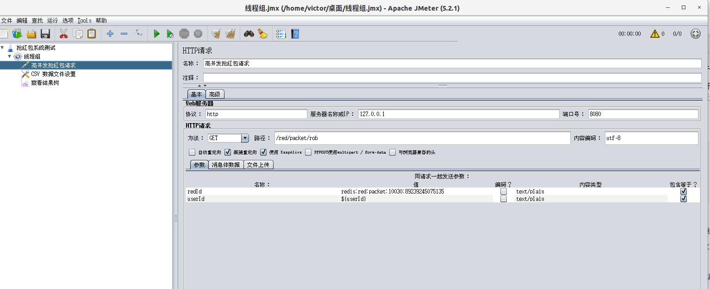

# 一、Redis应用场景之抢红包系统(四)

### 1、Jmeter压力测试高并发抢红包

- Apache Jmeter是Apache组织开发的基于Java的压力测试工具。可以用来模拟生产环境中高并发产生的巨大负载。
- [下载链接](https://downloads.apache.org//jmeter/binaries/apache-jmeter-5.2.1.tgz)

- 下载好后，解压运行Jmeter

  ```shell
  cd ~/下载/软件安装包
  tar -zxvf apache-jmeter-5.2.1.tgz
  cd apache-jmeter-5.2.1
  cd bin
  ./jmeter.sh
  ```

- 首先用Postman先新建一个用户userId假设为10030，生成一个新的红包全局id

  

- 测试计划-->右键-->添加-->线程(用户)-->线程组

  线程组面板，设置线程属性，设置线程数为1000个

  

- 线程组-->右键-->添加-->取样器-->HTTP请求

  

- 线程组-->右键-->添加-->配置原件-->CSV数据文件设置

  假设录入新的用户userId是从10030~10035的data.csv数据文件

  

  

  然后点击Jmeter上面的三角符号运行按钮进行测试

- 线程组-->右键-->添加-->监听器-->查看结果树

  

- 打开MySQL查询抢红包的明细表发现已经抢过红包的用户后续又抢到红包，比如10030已经抢过，后又抢到红包，说明是高并发引起的线程安全问题

  

### 2、问题分析

- 当某一时刻的同一个用户在疯狂的点红包，如果前端不加以控制，同一时间的同一个账户将发起多个抢红包请求。
- 后端接口接收到这些请求后，很可能同时在redis中判断是否有红包，并成功通过，然后导致一个用户抢到多个红包。
- 后端接口并没有考虑到高并发请求，原因在于当前请求还没有处理完核心业务逻辑，其他同样的请求过来，导致后端接口几乎来不及做重复判断

### 3、优化方案

- 同一时刻多个并发的线程对共享资源进行了访问操作，导致最终出现数据不一致或者结果并非自己所预料的现象，就是多线程高并发时出现的并发安全问题。
- 传统的单体Java应用，为了解决高并发，最常见的方法是在核心的业务逻辑代码中加锁，也就是Synchronized关键字。
- 在微服务、分布式系统架构，这样做法行不通，因为Synchronized关键字是跟单一服务节点所在的JVM相关联，而分布式系统架构的服务一般是部署在不同的节点服务器上，从而当出现高并发请求时，Synchronized同步操作力不从心。
- 为了保证单一节点核心业务代码的同步控制，也要保证当扩展到多个节点部署同样的实现核心业务逻辑，就出现了分布式锁。
- 分布式锁只是一种解决方案，主要是为了解决分布式系统高并发请求时出现并发访问共享资源导致的并发安全问题；
- 分布式锁的实现有多种
  - 基于数据库级别的乐观锁和悲观锁
  - 基于Redis的原子操作实现分布式锁
  - 基于Zookeeper实现分布式锁

### 4、Redis分布式锁实战

#### 4.1、redis的底层分析

- 由于Redis底层架构是采用单线程进行设计的，所以它提供的这些操作都是单线程的，也就是操作具有原子性。
- 原子性就是在同一时刻只能有一个线程来处理核心业务逻辑，当有其他线程对应的请求过来的时候，如果前面的线程没有处理完毕，那么当前线程将进入等待(阻塞)状态，直到前面的线程处理完毕。

#### 4.2、分布式锁实现

- 因为抢红包的核心业务逻辑在于拆红包操作。
- 可以通过redis的原子操作setIfAbsent()方法对业务逻辑加分布式锁
- setIfAbsent()方法：
  - 如果当前的key不存在redis中，就设置对应的value，然后返回true
  - 如果当前key存在，则设置value失败，返回false

- 方法具有原子性单线程操作，所以多个并发的线程同一时刻调用setIfAbsent()，redis底层会将线程加入队列排队处理

```java
 @Override
    public BigDecimal robByDistributeLock(Integer userId, String redId) throws Exception {
        ValueOperations valueOperations = redisTemplate.opsForValue();
        /**
         * 处理用户抢红包之前，需要先判断一下当前用户是否已经抢过红包
         * 如果抢过，则直接返回红包金额
         */
        Object data = valueOperations.get(redId + userId + ":rob");
        if (data != null) {
            BigDecimal redPacket = new BigDecimal(data.toString());
            log.info("从redis中获取数据，当前用户抢到红包了：userId={} key={} 金额={}", userId, redId, redPacket);
            return redPacket;
        }
        Boolean res = clilck(redId);
        //如果为true代表redis中仍然还有红包，也就是红包个数>0
        if (res) {
            //上分布式锁：一个红包每个人只能抢到一次随机金额，也即是永远保证一对一关系
            final String lockKey = redId+userId+"-lock";
            //调用setIfAbsent()方法，其实就是间接实现了分布式锁
            Boolean lock = valueOperations.setIfAbsent(lockKey, redId);
            //设置分布式锁的过期时间为24h
            redisTemplate.expire(lockKey,24L,TimeUnit.HOURS);
            try {
                //表示当前线程获取到了该分布式锁
                if(lock) {
                    //从小红包随机金额列表弹出一个随机金额
                    Object value = redisTemplate.opsForList().rightPop(redId);
                    if (value != null) {
                        /**
                         * 更新redis中剩余的红包个数，也就是红包个数减1
                         */
                        String redTotalKey = redId + ":total";
                        Object total = valueOperations.get(redTotalKey);
                        Integer curTotal = 0;
                        if (total != null) {
                            curTotal = (Integer) total;
                        }
                        valueOperations.set(redTotalKey, curTotal - 1);
                        //直接处理红包的单位变为分，如果此处不处理，需要前端处理也是一样的
                        BigDecimal redPacket = new BigDecimal(value.toString()).divide(new BigDecimal(100));
                        //将抢到红包的用户信息异步保存到数据库
                        redService.recordRobRedPacket(userId, redId, new BigDecimal(value.toString()));
                        //将当前用户抢到红包的用户设置到redis中，表示当前用户已经抢过红包了，设置过期时间24h
                        valueOperations.set(redId + userId + ":rob", redPacket, 24L, TimeUnit.HOURS);
                        log.info("当前用户抢到红包了：userId={} key={} 金额={}", userId, redId, redPacket);
                        return redPacket;
                    }
                }
            }catch (Exception e){
                throw new Exception("系统异常-抢红包-加分布式锁失败！");
            }
        }
        //null表示当前用户没有抢到红包
        return null;
    }
```

#### 4.3、测试结果

- 首先利用postman调用发红包接口，重新生成一个红包全局id

  然后配置到Jmeter的http请求的redId上

  

- 然后利用Jmeter测试步骤同样的，最后查看抢红包明细表发现，没有出现同一个账户又重复抢到红包的情况，从而实现分布式锁控制

  

### 5、总结与分析

- 代码的核心业务逻辑已经加上分布式锁，也能扛得住秒级高并发的请求，但是从业务层来看，我们只设置了10030~10035这6个用户来抢红包，发红包我们设置了10个红包，那么剩下4个红包的剩余金额还没处理，首先需要归还个发红包的人，这块业务逻辑就不在写。
- 多线程高并发时产生的并发安全问题，需要对核心业务处理逻辑加同步控制操作，也就是加上分布式锁