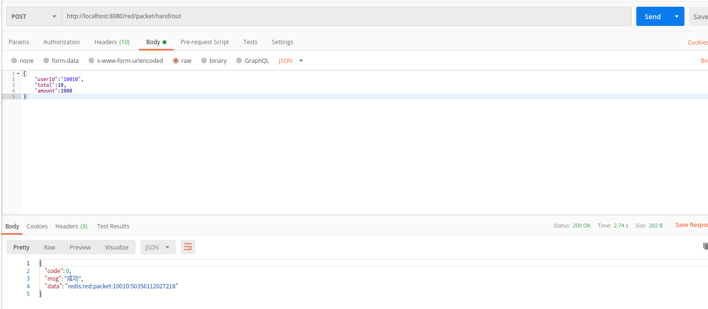

# 一、Redis应用场景之抢红包系统

### 1、业务流程

- 信息流：包括用户操作背后的请求通信和红包信息在不同用户与用户群中的流转等
- 业务流：主要包括发红包、点红包和抢红包等业务逻辑
- 资金流：主要包括红包背后的资金转账和入账等流程

#### 1.1、业务系统流程图


#### 1.2、业务流程分析

​		系统整体业务流程包括2大业务组成：发红包和抢红包。其中的拆红包又可以拆分2个小业务，用户点红包和用户拆红包。

##### 1.2.1、发红包整体业务流程


##### 1.2.2、抢红包整体业务流程


### 2、业务模块划分


- 缓存中间件Redis模块：主要用来发红包时缓存红包个数和由随机数算法产生的红包随机金额列表，同时将借助Redis单线程特性和操作的原子性实现抢红包时锁的操作
- 引入Redis一方面是大大减少高并发情况下频繁查询数据库的操作，减少数据库的压力。
- 另一方面是提供系统整体响应性能和保证数据的一致性。

### 3、数据库表设计与环境搭建

主要有3张表，发红包记录红包的信息表，发红包时对应的随机金额信息表，抢红包时用户抢到红包的金额记录表

#### 3.1、实体类Model

- 发红包记录表RedRecord

  ```java
  package com.victor.model.redpacket;
  
  import com.fasterxml.jackson.annotation.JsonFormat;
  import lombok.Data;
  import lombok.ToString;
  
  import javax.persistence.*;
  import java.math.BigDecimal;
  import java.util.Date;
  
  /**
   * @Description: 发红包记录表
    * @Author: VictorDan
   * @Version: 1.0
   */
  @Data
  @ToString
  @Entity
  @Table(name = "red_record")
  public class RedRecord {
      @Id
      @GeneratedValue(strategy = GenerationType.IDENTITY)
      @Column(name = "id")
      private Integer id;
      /**
       * 用户id
       */
      private Integer userId;
      /**
       * 红包全局唯一标识串
       */
      private String redPacket;
      /**
       * 红包指定可以抢的总人数
       */
      private Integer total;
      /**
       * 红包总金额
       */
      private BigDecimal amount;
      /**
       * 是否有效
       */
      private Boolean isActive;
  
      @JsonFormat(pattern = "yyyy-MM-dd HH:mm:ss",timezone = "GMT+8")
      private Date createTime;
  }
  
  ```

- 红包明细金额表RedDetail

  ```java
  package com.victor.model.redpacket;
  
  import com.fasterxml.jackson.annotation.JsonFormat;
  import lombok.Data;
  import lombok.ToString;
  
  import javax.persistence.*;
  import java.math.BigDecimal;
  import java.util.Date;
  
  /**
   * @Description: 红包明细金额表
   * @Author: VictorDan
   * @Version: 1.0
   */
  @Data
  @ToString
  @Entity
  @Table(name = "red_detail")
  public class RedDetail {
      @Id
      @GeneratedValue(strategy = GenerationType.IDENTITY)
      @Column(name = "id")
      private Integer id;
      /**
       * 红包记录id
       */
      private Integer recordId;
      /**
       * 红包随机金额
       */
      private BigDecimal amount;
      /**
       * 是否有效
       */
      private Boolean isActive;
  
      @JsonFormat(pattern = "yyyy-MM-dd HH:mm:ss",timezone = "GMT+8")
      private Date createTime;
  }
  ```

- 抢红包记录表RedRobRecord

  ```java
  package com.victor.model.redpacket;
  
  import com.fasterxml.jackson.annotation.JsonFormat;
  import lombok.Data;
  import lombok.ToString;
  
  import javax.persistence.*;
  import java.math.BigDecimal;
  import java.util.Date;
  
  /**
   * @Description: 抢红包记录表
   * @Author: VictorDan
   * @Version: 1.0
   */
  @Data
  @ToString
  @Entity
  @Table(name = "red_record")
  public class RedRobRecord {
      @Id
      @GeneratedValue(strategy = GenerationType.IDENTITY)
      @Column(name = "id")
      private Integer id;
      /**
       * 用户id
       */
      private Integer userId;
      /**
       * 红包全局唯一标识串
       */
      private String redPacket;
      /**
       * 抢到红包的金额
       */
      private BigDecimal amount;
      /**
       * 是否有效
       */
      private Boolean isActive;
      /**
       * 抢到时间
       */
      @JsonFormat(pattern = "yyyy-MM-dd HH:mm:ss",timezone = "GMT+8")
      private Date robTime;
  }
  ```

#### 3.2、持久层Repository

- 发红包记录表RedRecordRepo

  ```java
  package com.victor.repository.redpacket;
  
  import com.victor.model.redpacket.RedRecord;
  import org.springframework.data.jpa.repository.JpaRepository;
  import org.springframework.stereotype.Repository;
  
  /**
   * @Description:
   * @Author: VictorDan
   * @Version: 1.0
   */
  @Repository
  public interface RedRecordRepo extends JpaRepository<RedRecord,Long> {
  }
  ```

- 红包明细金额RedDetailRepo

  ```java
  package com.victor.repository.redpacket;
  
  import com.victor.model.redpacket.RedDetail;
  import org.springframework.data.jpa.repository.JpaRepository;
  import org.springframework.stereotype.Repository;
  
  /**
   * @Description:
   * @Author: VictorDan
   * @Version: 1.0
   */
  @Repository
  public interface RedDetailRepo extends JpaRepository<RedDetail,Long> {
  }
  ```

- 抢红包记录表RedRobRecordRepo

  ```java
  package com.victor.repository.redpacket;
  
  import com.victor.model.redpacket.RedRobRecord;
  import org.springframework.data.jpa.repository.JpaRepository;
  import org.springframework.stereotype.Repository;
  
  /**
   * @Description:
   * @Author: VictorDan
   * @Version: 1.0
   */
  @Repository
  public interface RedRobRecordRepo extends JpaRepository<RedRobRecord,Long> {
  }
  ```

### 4、开发流程介绍

​		抢红包系统处理用户请求的过程和数据流向如下：


#### 4.1、发红包请求处理

- 后端主要根据用户输入的金额和个数预生成相应的红包随机金额列表，然后将红包的总个数和对应的随机金额列表缓存到Redis中。
- 将红包的总金额、随机金额列表和红包全局唯一标识串信息异步记录到对应的数据库表中。

#### 4.2、抢红包请求处理

- 后端接口先接收到前端用户账号以及红包的全局唯一标识串等请求信息，假设用户账号合法性等信息全部校验通过，然后开始处理用户点开红包的逻辑
- 主要是从Redis中获取当前剩余的红包个数，根据红包个数是否大于0，则开始处理用户拆红包的逻辑。
- 拆红包逻辑主要是从Redis中的随机金额队列中弹出一个红包金额，并根据金额是否为null判断是否成功抢到红包

#### 4.3、状态码设计

- 保证系统整体开发流程规范，约定处理用户请求信息后将返回统一的响应格式。

- BaseResponse类

  ```java
  package com.victor.model.redpacket;
  
  import lombok.Data;
  import lombok.ToString;
  
  /**
   * @Description: 响应信息类
   * @Author: VictorDan
   * @Version: 1.0
   */
  @Data
  @ToString
  public class BaseResponse<T> {
      /**
       * 状态码
       */
      private Integer code;
      /**
       * 描述信息
       */
      private String msg;
      /**
       * 响应数据-采用泛型表示可以接受通用的数据类型
       */
      private T data;
  
      public BaseResponse(Integer code, String msg, T data) {
          this.code = code;
          this.msg = msg;
          this.data = data;
      }
  
      public BaseResponse(StatusCode statusCode) {
          this.code = statusCode.getCode();
          this.msg = statusCode.getMsg();
      }
  
      public BaseResponse(Integer code, String msg) {
          this.code = code;
          this.msg = msg;
      }
  }
  
  ```

- StatusCode类

  ```java
  package com.victor.model.redpacket;
  
  import lombok.ToString;
  
  /**
   * @Description: 状态码类
   * 注：状态码类是枚举类，所以不能使用@Data，需要自己生成getter/setter方法
   * @Author: VictorDan
   * @Version: 1.0
   */
  @ToString
  public enum  StatusCode {
      /**
       * 以下是暂时设定的几种状态码
       */
      Success(0,"成功"),
      Fail(-1,"失败"),
      InvalidParams(201,"非法参数！"),
      InvalidGrantType(202,"非法的授权类型");
  
      /**
       * 状态码
       */
      private Integer code;
      /**
       * 描述信息
       */
      private String msg;
      
      StatusCode(Integer code,String msg) {
          this.code=code;
          this.msg=msg;
      }
  
      public Integer getCode() {
          return code;
      }
  
      public String getMsg() {
          return msg;
      }
  
      public void setCode(Integer code) {
          this.code = code;
      }
  
      public void setMsg(String msg) {
          this.msg = msg;
      }
  }
  ```

#### 4.4、红包金额随机生成算法

- 抢红包系统的核心部分主要在于抢红包的逻辑处理，而能否抢到红包，主要取决于红包个数和红包随机金额列表。

- 红包随机金额列表采用预生成的方式，也就是通过给定红包的总金额M和总人数N，采用随机数算法生成红包随机金额列表，并将它放到Redis中，用来拆分红逻辑的处理

##### 1、随机数算法要求

- 所有人抢到的金额之和等于红包金额
- 每个人至少抢到0.01元
- 要保证所有人抢到金额的记录相等。

采用蒙特卡洛方法，主要构造一个数学模型，将若干个随机变量和统计分析的方法求出若干个随机数。

##### 2、二倍均值法

- 实际中红包随机金额的生成算法有许多，二倍均值法是比较典型。
- 根据每次剩余的总金额M和剩余人数N，执行M/N，然后在乘以2,所得到的数E，在0到E的区间内，随机产生一个随机金额。
- 重复上面的步骤，直到剩余最后一个人。

```java
package com.victor.util;

import java.util.ArrayList;
import java.util.List;
import java.util.Random;

/**
 * @Description: 发红包工具类
 * @Author: VictorDan
 * @Version: 1.0
 */
public class RedPacketUtil {
    /**
     * 发红包算法，二倍均值法
     *
     * @param totalAmount    红包总金额，单位为分
     * @param totalPeopleNum 总人数
     * @return
     */
    public static List<Integer> divideRedPacket(Integer totalAmount, Integer totalPeopleNum) {
        List<Integer> list = new ArrayList<>();
        /**
         * 判断总金额和总个数参数的合法性
         */
        if (totalAmount > 0 && totalPeopleNum > 0) {
            //记录剩余总金额，初始化为红包总金额
            Integer restAmount = totalAmount;
            //记录剩余总人数，初始化为指定的总人数
            Integer restPeopleNum = totalPeopleNum;
            //产生随机数
            Random random = new Random();
            //不断循环遍历，更新迭代产生随机金额，直到N-1>0
            for (int i = 0; i < totalPeopleNum - 1; i++) {
                //随机范围:[1,剩余人均金额的两倍),随机金额为分，至少一个人得到1分钱
                int amount = random.nextInt(restAmount / restPeopleNum * 2 - 1) + 1;
                //更新剩余的总金额
                restAmount = restAmount - amount;
                //更新剩余的人数
                restPeopleNum--;
                //将产生的随机金额加入到list
                list.add(amount);
            }
            //循环完毕，将剩余的金额也即是最后一个随机金额，加入到list
            list.add(restAmount);
        }
        return list;
    }
}
```

### 5、发红包模拟实战

- 发红包模块的核心处理逻辑在于接受前端发红包设定的总金额M和总个数N，后端接口根据这2个参数，然后采用二倍均值算法生成N个随机金额的红包，最后将红包个数N和随机金额list存到缓存，然后把相关的数据异步记录到数据库中。
- 后端接口在接收到前端用户发红包请求的时候，可以采用时间戳作为红包全局唯一标识串，然后将这个串返回给前端，后续用户发红包的时候，会带上这个参数，目的为了给发出的红包打标记，把这个标记作为key去缓存中查询红包个数和随机金额列表等。

#### 5.1、发红包请求参数RedPacketRequest

```java
package com.victor.model.redpacket;

import lombok.Data;
import lombok.ToString;

import javax.validation.constraints.NotNull;

/**
 * @Description: 处理发红包的请求参数
 * @Author: VictorDan
 * @Version: 1.0
 */
@Data
@ToString
public class RedPacketRequest {
    /**
     * 用户账号id
     */
    private Integer userId;
    /**
     * 红包个数
     */
    @NotNull
    private Integer total;
    /**
     * 总金额-单位为分
     */
    @NotNull
    private Integer amount;
}
```

#### 5.2、发红包的控制器RedPacketController

```java
package com.victor.controller;

import com.victor.model.redpacket.RedPacketRequest;
import com.victor.model.redpacket.BaseResponse;
import com.victor.model.redpacket.StatusCode;
import com.victor.service.redpacket.IRedPacketService;
import lombok.extern.slf4j.Slf4j;
import org.springframework.beans.factory.annotation.Autowired;
import org.springframework.validation.BindingResult;
import org.springframework.validation.annotation.Validated;
import org.springframework.web.bind.annotation.PostMapping;
import org.springframework.web.bind.annotation.RequestBody;
import org.springframework.web.bind.annotation.RestController;

/**
 * @Description: 红包处理逻辑Controller
 * @Author: VictorDan
 * @Version: 1.0
 */
@RestController
@Slf4j
public class RedPacketController {

    @Autowired
    private IRedPacketService redPacketService;

    private static final String PREFIX = "red/packet";

    /**
     * 发红包-请求方式为post，数据格式采用JSON交互
     *
     * @param request
     * @param result
     * @return
     */
    @PostMapping(value = PREFIX + "/hand/out")
    public BaseResponse handOut(@Validated @RequestBody RedPacketRequest request, BindingResult result) {
        //参数校验
        if (result.hasErrors()) {
            return new BaseResponse(StatusCode.InvalidParams);
        }
        BaseResponse<String> response = new BaseResponse<>(StatusCode.Success);
        String redId;
        try {
            //核心业务逻辑处理，然后返回红包的唯一标识串
            redId = redPacketService.handOut(request);
            response.setData(redId);
        } catch (Exception e) {
            log.error("发红包发生异常，请求request={},异常信息为：{}", request, e.getMessage());
            return new BaseResponse(StatusCode.Fail.getCode(), e.getMessage());
        }
        return response;
    }
}
```

#### 5.3、发红包的核心逻辑Service

- 发红包接口IRedPacketService

```java
package com.victor.service.redpacket;

import com.victor.model.redpacket.RedPacketRequest;

import java.math.BigDecimal;

/**
 * @Description:
 * @Author: VictorDan
 * @Version: 1.0
 */
public interface IRedPacketService {
    /**
     * 发红包核心业务逻辑
     * @param request
     * @return
     * @throws Exception
     */
    String handOut(RedPacketRequest request) throws Exception;

    /**
     * 抢红包
     * @param userId
     * @param redId
     * @return
     */
    BigDecimal rob(Integer userId,String redId);
}
```

- 发红包核心逻辑

  ```java
  package com.victor.service.redpacket.impl;
  
  import com.victor.model.redpacket.RedPacketRequest;
  import com.victor.service.redpacket.IRedPacketService;
  import com.victor.service.redpacket.IRedService;
  import com.victor.util.RedPacketUtil;
  import lombok.extern.slf4j.Slf4j;
  import org.springframework.beans.factory.annotation.Autowired;
  import org.springframework.data.redis.core.RedisTemplate;
  import org.springframework.stereotype.Service;
  
  import java.math.BigDecimal;
  import java.util.List;
  
  /**
   * @Description:
   * @Author: VictorDan
   * @Version: 1.0
   */
  @Service
  @Slf4j
  public class RedPacketServiceImpl implements IRedPacketService {
      @Autowired
      private RedisTemplate redisTemplate;
      /**
       * 红包业务逻辑处理过程记录到数据库的服务
       */
      @Autowired
      private IRedService redService;
  
      //存储到Redis中定义key前缀
      private static final String KEY_PREFIX = "redis:red:packet:";
  
      /**
       * 发红包
       *
       * @param request
       * @return
       * @throws Exception
       */
      @Override
      public String handOut(RedPacketRequest request) throws Exception {
          if (request.getTotal() > 0 && request.getTotal() > 0) {
              List<Integer> list = RedPacketUtil.divideRedPacket(request.getAmount(), request.getTotal());
              //生成红包全局唯一标识串
              String timestamp = String.valueOf(System.nanoTime());
              //根据缓存key的前缀与其他信息拼接成一个新的用来存储红包总数的key
              String redId = KEY_PREFIX + request.getUserId() + ":" + timestamp;
              //将随机金额写入到redis的list中（从队列左边全部push进去）
              redisTemplate.opsForList().leftPushAll(redId, list);
              //将红包总个数写入redis中
              String redTotalKey = redId + ":total";
              redisTemplate.opsForValue().set(redTotalKey, request.getTotal());
              //异步记录红包的全局标识符，红包个数与随机金额列表到数据库
              redService.recordRedPacket(request, redId, list);
              //返回红包的全局唯一标识符给前端
              return redId;
          } else {
              throw new Exception("系统异常--->分发红包参数不合法");
          }
  
      }
  
      @Override
      public BigDecimal rob(Integer userId, String redId) {
          return null;
      }
  }
  ```

#### 5.4、异步保存红包业务逻辑处理过程数据到数据库

- 红包业务逻辑处理过程数据接口

  ```java
  package com.victor.service.redpacket;
  
  import com.victor.model.redpacket.RedPacketRequest;
  
  import java.util.List;
  
  /**
   * @Description: 红包业务逻辑处理过程数据记录
   * @Author: VictorDan
   * @Version: 1.0
   */
  public interface IRedService {
      /**
       * 记录发红包
       * @param dto
       * @param redId
       * @param list
       */
      void recordRedPacket(RedPacketRequest dto, String redId, List<Integer> list);
  }
  
  ```

- 红包业务逻辑处理过程数据实现类

  ```java
  package com.victor.service.redpacket.impl;
  
  import com.victor.model.redpacket.RedPacketRequest;
  import com.victor.model.redpacket.RedDetail;
  import com.victor.model.redpacket.RedRecord;
  import com.victor.repository.redpacket.RedDetailRepo;
  import com.victor.repository.redpacket.RedRecordRepo;
  import com.victor.repository.redpacket.RedRobRecordRepo;
  import com.victor.service.redpacket.IRedService;
  import lombok.extern.slf4j.Slf4j;
  import org.springframework.beans.factory.annotation.Autowired;
  import org.springframework.scheduling.annotation.Async;
  import org.springframework.stereotype.Service;
  import org.springframework.transaction.annotation.Transactional;
  
  import java.math.BigDecimal;
  import java.util.Date;
  import java.util.List;
  
  /**
   * @Description: 红包业务逻辑处理过程数据记录
   * @Author: VictorDan
   * @Version: 1.0
   */
  @Slf4j
  @Service
  public class RedServiceImpl implements IRedService {
      @Autowired
      private RedRecordRepo redRecordRepo;
  
      @Autowired
      private RedDetailRepo redDetailRepo;
  
      @Autowired
      private RedRobRecordRepo redRobRecordRepo;
  
      /**
       * 发红包记录-异步方式
       * @param dto 红包总金额+个数
       * @param redId 红包全局唯一标识串
       * @param list 红包随机金额列表
       */
      @Transactional(rollbackFor = Exception.class)
      @Async
      @Override
      public void recordRedPacket(RedPacketRequest dto, String redId, List<Integer> list){
          RedRecord redRecord = new RedRecord();
          redRecord.setUserId(dto.getUserId());
          redRecord.setAmount(BigDecimal.valueOf(dto.getAmount()));
          redRecord.setTotal(dto.getTotal());
          redRecord.setRedPacket(redId);
          redRecord.setIsActive(true);
          redRecord.setCreateTime(new Date());
          //保存到发红包记录表
          redRecordRepo.save(redRecord);
  
          RedDetail redDetail;
          //遍历随机金额列表，将金额等信息设置到对应字段
          for (Integer data:list) {
              redDetail = new RedDetail();
              redDetail.setRecordId(redRecord.getId());
              redDetail.setAmount(BigDecimal.valueOf(data));
              redDetail.setCreateTime(new Date());
              redDetail.setIsActive(true);
              //保存红包明细金额表
              redDetailRepo.saveAndFlush(redDetail);
          }
  
      }
  }
  ```

#### 5.5、测试结果

- 使用PostMan测试接口结果如下：

  

- 查看数据库记录

  ```mysql
  #查看发红包表
  SELECT * FROM victor.red_record;
  #查看红包明细表，是否对应总金额
  SELECT sum(amount) FROM victor.red_detail where record_id=1 and is_active=1;
  ```
  
  - 查看发红包表
  
  
  
  - 查看红包明细表
  
    
  
  - 汇总红包明细表的金额与总金额对比
  
    