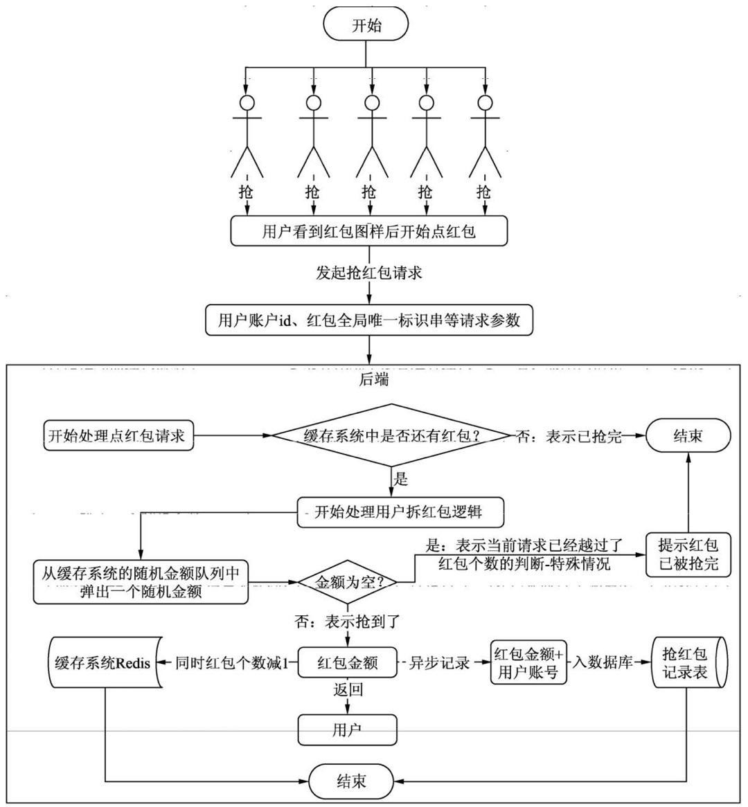
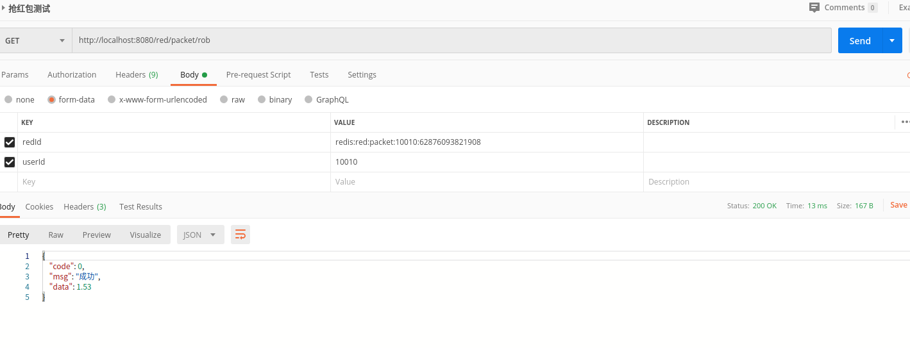
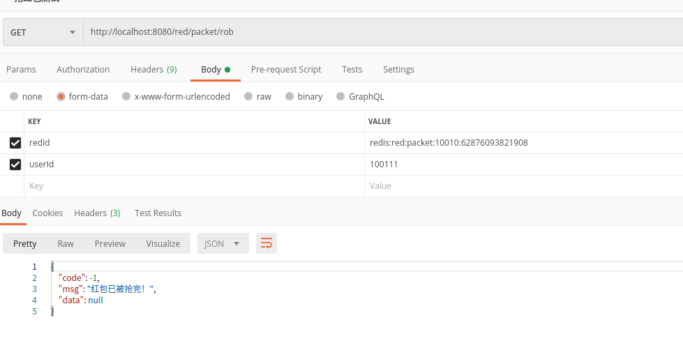
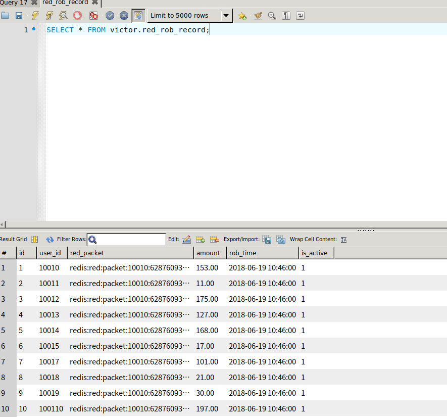
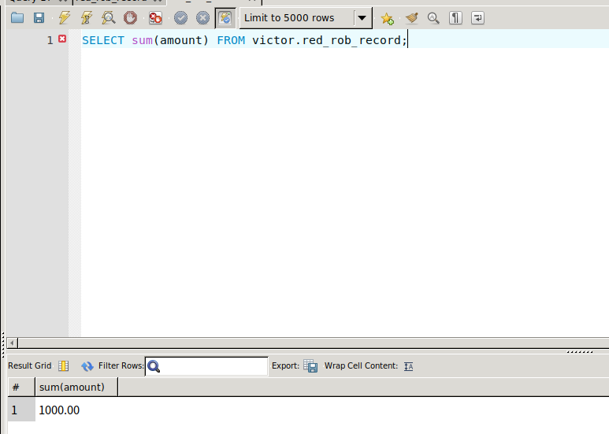

# 一、Redis应用场景之抢红包系统(三)

### 1、业务模块分析

- 抢红包业务对应的后端接口需要频繁的访问Redis，用来获取红包剩余个数和随机金额列表，来判断用户点红包、拆红包是否成功。
- 用户每次成功抢到红包之后，后端接口需要及时更新缓存系统中红包剩余个数，将相应的信息保存到数据库

### 2、开发流程介绍

​		抢红包系统处理用户请求的过程和数据流向如下：



### 3、抢红包模拟实战

- 前端用户发起抢红包请求，需要带上红包全局唯一标识串redId和当前用户userId。
- 后端接口根据redId去查询Redis中获取红包剩余个数和随机金额列表。

#### 3.1、发红包的控制器RedPacketController

```java
package com.victor.controller;

import com.victor.model.redpacket.RedPacketRequest;
import com.victor.model.redpacket.BaseResponse;
import com.victor.model.redpacket.StatusCode;
import com.victor.service.redpacket.IRedPacketService;
import lombok.extern.slf4j.Slf4j;
import org.springframework.beans.factory.annotation.Autowired;
import org.springframework.validation.BindingResult;
import org.springframework.validation.annotation.Validated;
import org.springframework.web.bind.annotation.PostMapping;
import org.springframework.web.bind.annotation.RequestBody;
import org.springframework.web.bind.annotation.RestController;

/**
 * @Description: 红包处理逻辑Controller
 * @Author: VictorDan
 * @Version: 1.0
 */
@RestController
@Slf4j
public class RedPacketController {

    @Autowired
    private IRedPacketService redPacketService;

    private static final String PREFIX = "red/packet";
    
    /**
     * 抢红包-请求方式为Get
     * @param userId
     * @param redId
     * @return
     */
    @GetMapping(value = PREFIX + "/rob")
    public BaseResponse rob(@RequestParam Integer userId, @RequestParam String redId) {
        BaseResponse<BigDecimal> response = new BaseResponse<>(StatusCode.Success);
        /**
         * 调用抢红包，返回最终的红包金额，如果为null表示已被抢完
         */
        BigDecimal data = redPacketService.rob(userId, redId);
        if (data != null) {
            response.setData(data);
        } else {
            response = new BaseResponse<>(StatusCode.Fail.getCode(), "红包已被抢完！");
        }
        return response;

    }
}

```

#### 2.3、抢红包的核心逻辑Service

- 抢红包接口IRedPacketService

```java
package com.victor.service.redpacket;

import com.victor.model.redpacket.RedPacketRequest;

import java.math.BigDecimal;

/**
 * @Description:
 * @Author: VictorDan
 * @Version: 1.0
 */
public interface IRedPacketService {
    /**
     * 发红包核心业务逻辑
     * @param request
     * @return
     * @throws Exception
     */
    String handOut(RedPacketRequest request) throws Exception;

    /**
     * 抢红包
     * @param userId
     * @param redId
     * @return
     */
    BigDecimal rob(Integer userId,String redId);
}
```

- 抢红包核心逻辑

  ```java
  package com.victor.service.redpacket.impl;
  
  import com.victor.model.redpacket.RedPacketRequest;
  import com.victor.service.redpacket.IRedPacketService;
  import com.victor.service.redpacket.IRedService;
  import com.victor.util.RedPacketUtil;
  import lombok.extern.slf4j.Slf4j;
  import org.springframework.beans.factory.annotation.Autowired;
  import org.springframework.data.redis.core.RedisTemplate;
  import org.springframework.stereotype.Service;
  
  import java.math.BigDecimal;
  import java.util.List;
  
  /**
   * @Description:
   * @Author: VictorDan
   * @Version: 1.0
   */
  @Service
  @Slf4j
  public class RedPacketServiceImpl implements IRedPacketService {
      @Autowired
      private RedisTemplate redisTemplate;
      /**
       * 红包业务逻辑处理过程记录到数据库的服务
       */
      @Autowired
      private IRedService redService;
  
      //存储到Redis中定义key前缀
      private static final String KEY_PREFIX = "redis:red:packet:";
  
      /**
       * 抢红包
       * @param userId 当前抢红包的用户id
       * @param redId 红包的全局唯一标识符
       * @return
       */
      @Override
      public BigDecimal rob(Integer userId, String redId) {
          ValueOperations valueOperations = redisTemplate.opsForValue();
          /**
           * 处理用户抢红包之前，需要先判断一下当前用户是否已经抢过红包
           * 如果抢过，则直接返回红包金额
           */
          Object data = valueOperations.get(redId + userId + ":rob");
          if (data != null) {
              BigDecimal redPacket = new BigDecimal(data.toString());
              log.info("从redis中获取数据，当前用户抢到红包了：userId={} key={} 金额={}", userId, redId, redPacket);
              return redPacket;
          }
          Boolean res = clilck(redId);
          //如果为true代表redis中仍然还有红包，也就是红包个数>0
          if (res) {
              //从小红包随机金额列表弹出一个随机金额
              Object value = redisTemplate.opsForList().rightPop(redId);
  
              if (value != null) {
                  /**
                   * 更新redis中剩余的红包个数，也就是红包个数减1
                   */
                  String redTotalKey = redId + ":total";
                  Object total = valueOperations.get(redTotalKey);
                  Integer curTotal = 0;
                  if (total != null) {
                      curTotal = (Integer) total;
                  }
                  valueOperations.set(redTotalKey, curTotal - 1);
                  //直接处理红包的单位变为分，如果此处不处理，需要前端处理也是一样的
                  BigDecimal redPacket = new BigDecimal(value.toString()).divide(new BigDecimal(100));
                  //将抢到红包的用户信息异步保存到数据库
                  redService.recordRobRedPacket(userId, redId, new BigDecimal(value.toString()));
                  //将当前用户抢到红包的用户设置到redis中，表示当前用户已经抢过红包了，设置过期时间24h
                  valueOperations.set(redId + userId + ":rob", redPacket, 24L, TimeUnit.HOURS);
                  log.info("当前用户抢到红包了：userId={} key={} 金额={}", userId, redId, redPacket);
                  return redPacket;
              }
          }
          //null表示当前用户没有抢到红包
          return null;
      }
  
      /**
       * 点红包的业务逻辑，如果为true代表还有红包，否则代表红包已经抢光
       *
       * @param redId
       * @return
       */
      private Boolean clilck(String redId) {
          ValueOperations valueOperations = redisTemplate.opsForValue();
          String redIdKey = redId + ":total";
          /**
           * 获取redis中红包的剩余个数
           */
          Object total = valueOperations.get(redIdKey);
          /**
           * 判断红包剩余个数total是否大于0，如果大于0，则返回true代表还有红包，否则false
           */
          return total != null && Integer.valueOf(total.toString()) > 0;
  
      }
  }
  ```

#### 2.4、异步保存红包业务逻辑处理过程数据到数据库

- 红包业务逻辑处理过程数据接口

  ```java
  package com.victor.service.redpacket;
  
  import com.victor.model.redpacket.RedPacketRequest;
  
  import java.util.List;
  
  /**
   * @Description: 红包业务逻辑处理过程数据记录
   * @Author: VictorDan
   * @Version: 1.0
   */
  public interface IRedService {
      /**
       * 记录发红包
       * @param dto
       * @param redId
       * @param list
       */
      void recordRedPacket(RedPacketRequest dto, String redId, List<Integer> list);
      
      /**
       * 将抢到红包的用户信息以及红包金额异步保存到数据库
       * @param userId
       * @param redId
       * @param data
       */
      void recordRobRedPacket(Integer userId, String redId, BigDecimal data);
  }
  
  ```

- 红包业务逻辑处理过程数据实现类

  ```java
  package com.victor.service.redpacket.impl;
  
  import com.victor.model.redpacket.RedPacketRequest;
  import com.victor.model.redpacket.RedDetail;
  import com.victor.model.redpacket.RedRecord;
  import com.victor.repository.redpacket.RedDetailRepo;
  import com.victor.repository.redpacket.RedRecordRepo;
  import com.victor.repository.redpacket.RedRobRecordRepo;
  import com.victor.service.redpacket.IRedService;
  import lombok.extern.slf4j.Slf4j;
  import org.springframework.beans.factory.annotation.Autowired;
  import org.springframework.scheduling.annotation.Async;
  import org.springframework.stereotype.Service;
  import org.springframework.transaction.annotation.Transactional;
  
  import java.math.BigDecimal;
  import java.util.Date;
  import java.util.List;
  
  /**
   * @Description: 红包业务逻辑处理过程数据记录
   * @Author: VictorDan
   * @Version: 1.0
   */
  @Slf4j
  @Service
  public class RedServiceImpl implements IRedService {
      @Autowired
      private RedRecordRepo redRecordRepo;
  
      @Autowired
      private RedDetailRepo redDetailRepo;
  
      @Autowired
      private RedRobRecordRepo redRobRecordRepo;
  
      /**
       * 将成功抢到红包的用户信息以及红包金额异步保存到数据库
       * @param userId 用户账号
       * @param redId 红包全局唯一标识串
       * @param data 抢到的红包金额
       */
      @Override
      @Async
      @Transactional(rollbackFor = Exception.class)
      public void recordRobRedPacket(Integer userId, String redId, BigDecimal data){
          RedRobRecord redRobRecord = new RedRobRecord();
          redRobRecord.setAmount(data);
          redRobRecord.setUserId(userId);
          //红包的全局唯一标识串
          redRobRecord.setRedPacket(redId);
          redRobRecord.setRobTime(new Date());
          redRobRecord.setIsActive(true);
          //将抢到红包的信息保存到数据库
          redRobRecordRepo.saveAndFlush(redRobRecord);
      }
  }
  ```

#### 2.5、测试结果

​	分别输入10个userId，假设输入的从10010到10019,然后当输入到10011就会提示红包抢光

- 使用PostMan测试接口结果如下：

  

  

- 查看数据库记录

  ```mysql
  #查看发红包表
  SELECT * FROM victor.red_record;
  #查看红包明细表，是否对应总金额
  SELECT sum(amount) FROM victor.red_detail where record_id=1 and is_active=1;
  ```

  - 查看抢红包表

    

  - 汇总红包明细表的金额与总金额对比

    

### 4、开发总结

#### 4.1、缺陷

- 首先这些请求都是串行的，因为在PostMan测试的时候，都是一个一个账户的请求，是有时间间隔的。
- 没有达到生产环境中秒级高并发请求。
- 高并发就是，在同一时刻突然有成千上万甚至百千万的数量级请求到达后端接口。
- 这里没有考虑高并发抢红包的情况，高并发请求的本质是高并发多线程，多线程的高并发如果出现抢占共享资源而不加以控制，会造成数据不一致。