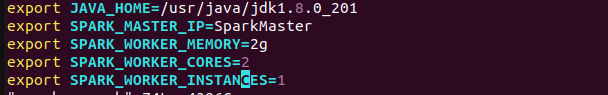
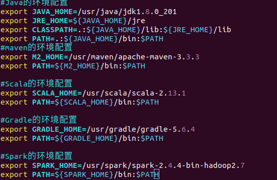
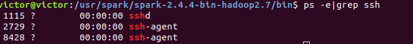
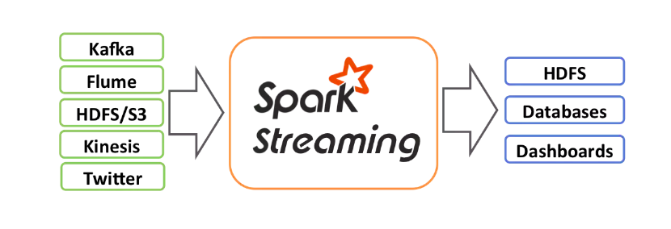
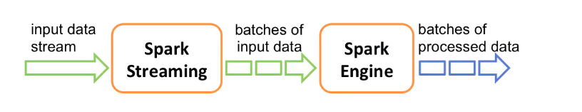

# 一、Spark Core的学习

#### 1、下载并安装Spark

[下载链接](http://mirrors.tuna.tsinghua.edu.cn/apache/spark/spark-2.4.4/spark-2.4.4-bin-hadoop2.7.tgz)

```shell
#安装spark相关命令
cd /usr
sudo mkdir spark
cd ~/下载/软件安装包
sudo mv spark-2.4.4-bin-hadoop2.7.tgz /usr/spark/
cd /usr/spark/
sudo tar -zxvf spark-2.4.4-bin-hadoop2.7.tgz
cd spark-2.4.4-bin-hadoop2.7/
#配置spark相关文件,切换到conf目录
cd conf/
#复制一个模板sh文件，设置spark的
cp spark-env.sh.template spark-env.sh
#配置spark需要的jdk环境，以及使用的内存，核心数
export JAVA_HOME=/usr/java/jdk1.8.0_201
export SPARK_MASTER_IP=SparkMaster
export SPARK_WORKER_MEMORY=2g
export SPARK_WORKER_CORES=2
export SPARK_WORKER_INSTANCES=1
cp slaves.template slaves 
#配置spark的slave
vim slaves
```



#### 2、首先要有jdk，scala

```shell
#修改当前用户的环境变量文件
vim ~/.bashrc
#保存
source ~/.bashrc
```



#### 3、操作spark并启动

```shell
cd /sbin
#如果发现报错，拒绝连接本地，则说明没有安装ssh
#启动spark的简单集群
./start-all.sh
#发现还是一样，拒绝连接本地
ssh localhost
#发现只有ssh-agent，而没有sshd
ps -e|grep ssh
#安装ssh
sudo apt update
sudo apt upgrade
sudo apt install openssh-server
ps -e|grep ssh
#重新启动
./start-all.sh
#打开浏览器访问
lhttp://victor:8081/
```



- 启动spark-shell

  ```shell
  cd bin/
  #python下的spark shell
  pyspark
  #scala下的spark shell
  spark-shell
  ```

### 1、简介

- Spark流是对于Spark核心API的扩展，从而支持对于实时数据流的可扩展，高吞吐量和容错性流处理。数据可以由多个源取的，比如Kafka，Flume，ZeroMQ，或者TCP接口等。可以同时使用比如map，reduce，join和window这样的高层接口描述的复杂算法进行处理。最终，处理过得数据可以保存到HDFS，数据库等。

  

- 在内部，Spark Streaming接收到实时数据流同时将其划分为分批，也就是微批处理。这些数据的分批将会被Spark的引擎所处理而生成同样按批次形式的最终流。

  

- Spark Streaming提供了被成为离散化或者DStream的高层抽象，这个高层抽象用于表示数据的连续流。

  创建DStream的2种方式：

  - 由Kafka，Flume(一个日志收集中间件)，取的数据作为输入流
  - 在其他DStream进行的高层操作。
  - 在内部，DStream被表达为RDDs的一个序列。

### 2、Spark的组件介绍

#### 2.1、Spark Core

​	实现了Spark的基本功能，包含任务调度、内存管理、错误恢复、与存储系统交互等模块。Spark Core中包含了对RDD(弹性分布式数据集)的API定义。

​	RDD表示分布在多个计算节点上可以并行操作的元素集合，是Spark的主要编程抽象。Spark Core提供了创建和操作这些集合的多个API。

#### 2.2、SparkSQL

​	SparkSQL是Spark用来操作结构化数据的程序包。通过SparkSQL，可以使用SQL或者Hive的HQL来查询数据。SparkSQL支持多种数据源，比如<font color=red>Hive表，JSON</font>等。

​	SparkSQL除了提供一个SQL接口，还支持将SQL和传统的RDD编程的数据相结合的操作。

#### 2.3、Spark Streaming

​	Spark Streaming是<font color=red>Spark提供对实时数据进行流式计算的组件</font>。比如生产环境的网页服务器日志，或者用户提交的状态更新组成的消息队列，都是数据流。Spark Streaming提供了用来操作数据流的API。与Spark Core中的RDD API高度对应。不论是操作内存或者硬盘的数据，还是操作实时的数据流，都可以应对自如。Spark Streaming支持与Spark Core同级别的容错性、吞吐量以及可伸缩性。

#### 2.4、MLib

​	Spark中的一个提供常见机器学习ML的库。提供了很多机器学习算法，包括分类、回归、聚类、协同过滤等。还提供了模型评估、数据导入等额外的支持功能功能。MLib还提供了一些更底层的机器学原语，包含一个通用的梯度下降优化算法。

#### 2.5、GraphX

​	GraphX是用来操作图的程序库，可以进行并行的图计算。与Spark Streaming和SparkSQL类似。GraphX也扩展了Spark Core的RDD API，用来创建一个顶点和边都包含任艺术型的有向图。

​	个人理解：有点类似TensorFlow的TensorBoard。

#### 1.6、集群管理器

​	包括<font color=red>Hadoop YARN，Apache Mesos，以及Spark自带的一个简易调度器，独立调度器</font>。这样可以高效的在一个计算节点到数千个计算节点之前伸缩设计算。如果单独安装Spark，没有任何集群管理的机器，则有子代的独立调度器。或者在装有Hadoop YARN或者Mesos的集群上安装Spark。

#### 1.7、总结

​	Spark不仅可以读取HDFS上的文件作为数据集，还支持本地文件，Amazon S3，Cassandra，Hive，HBase等数据集。总之，Hadoop不是Spark的必须必备的。

### 3、Spark的使用

#### 3.1、在Java中使用Spark

​	连接Spark的过程在各个语言中不一样。在Java和Scala中，只需要在pom.xml中添加spark-core的maven依赖。

```xml
<!-- https://mvnrepository.com/artifact/org.apache.spark/spark-core -->
    <dependency>
      <groupId>org.apache.spark</groupId>
      <artifactId>spark-core_2.12</artifactId>
      <version>2.4.3</version>
    </dependency>
```

#### 3.2、初始化SparkContext

​	完成应用项目与Spark的连接，需要在程序中导入Spark的包，并创建SparkContext上下文。

```java
import org.apache.spark.SparkConf;
import org.apache.spark.api.java.JavaSparkContext;
public void test3(){
        //连接spark集群
        SparkConf sparkConf = new SparkConf().setMaster("local").setAppName("wordCount");
        //创建上下文
        JavaSparkContext javaSparkContext = new JavaSparkContext(sparkConf);
        //读取文件里的数据作为输入数据
        JavaRDD<String> rdd = javaSparkContext.textFile("/inputFile");
        //切分为单词，以空格为分割
        JavaRDD<String> words = rdd.flatMap((FlatMapFunction<String, String>) s -> (Iterator<String>) Arrays.asList(s.split(" ")));
        //转换为kv并计数。把a:1,b:1,c:1,b:1转为a:1,b:2,c:1如此格式。
        JavaPairRDD<String, Integer> counts = words.mapToPair((PairFunction<String, String, Integer>) s -> new Tuple2(s, 1))
                .reduceByKey((Function2<Integer, Integer, Integer>) (x, y) -> x + y);
        //将统计出来的单词总数存入一个文本文件。
        counts.saveAsTextFile("/outputFile");
        //关闭spark
        javaSparkContext.stop();
        System.out.println(javaSparkContext.version());
    }
```

- setMaster()：传递集群的URL，告诉Spark如何连接到集群上。
- setAppName():当你连接到一个集群时，这个值可以帮你在集群管理器cluster manager的用户界面中找到你的应用。

#### 3.3、总结

​	Spark的核心编程，通过一个驱动器SparkConf创建一个SparkContext和一系列的RDD。然后进行并行操作。

### 4、RDD的使用

​	Spark对数据的核心抽象：弹性分布式数据集(Resilient Distributed Dataset)。RDD本质就是分布式的元素集合。在Spark中，对数据的所有操作就是创建RDD，转化已有的RDD和调用RDD进行求值。Spark会自动将RDD中的数据分发到集群，操作并行化执行。

​	<font color=red>RDD是Spark的核心</font>

#### 4.1、创建RDD

​	RDD是一个不可变的分布式对象集合。每个RDD都被分成多个分区，这些分区运行在集群中不同的节点上。

​	可以使用2种方法创建RDD：

- 读取外部数据集

  比如使用SparkContext.textFile()来读取文本文件作为一个字符串RDD。

  ```java
  /**
       * spark有2种创建RDD的方式：1、读取外部数据集  2、在驱动器程序中对一个集合进行并行化操作。
       */
      package spark;
  
  import org.apache.spark.SparkConf;
  import org.apache.spark.api.java.JavaPairRDD;
  import org.apache.spark.api.java.JavaRDD;
  import org.apache.spark.api.java.JavaSparkContext;
  import scala.Tuple2;
  
  import java.util.Arrays;
  import java.util.List;
  import java.util.regex.Pattern;
  
  /**
   * @Description:
   * @Author: VictorDan
   * @Date: 19-11-6 下午2:31
   * @Version: 1.0
   */
  public class Spark {
      private static final Pattern SPACE = Pattern.compile(" ");
  
      public static void main(String[] args) {
          SparkConf conf = new SparkConf().setMaster("local").setAppName("wc");
          JavaSparkContext context = new JavaSparkContext(conf);
          JavaRDD<String> lines = context.textFile("/home/victor/桌面/file.txt");
          JavaRDD<String> words = lines.flatMap(s -> Arrays.asList(SPACE.split(s)).iterator());
          JavaPairRDD<String, Integer> ones = words.mapToPair(s -> new Tuple2<>(s, 1));
          JavaPairRDD<String, Integer> counts = ones.reduceByKey((i1, i2) -> i1 + i2);
          List<Tuple2<String, Integer>> output = counts.collect();
          for (Tuple2<?, ?> tuple : output) {
              System.out.println(tuple._1() + ": " + tuple._2());
          }
  
          //spark去重操作
          JavaPairRDD<String, Integer> distinct = counts.distinct();
          System.out.println(distinct);
          //spark合并
          List<Tuple2<String, Integer>> collect = distinct.collect();
          collect.forEach(System.out::println);
  
      }
  }
  
  ```

- 在驱动程序里分发驱动器程序中的对象集合(list,set)

  ```java
      @Test
      public void parallizeDataCreateRDD(){
          //连接spark集群
          SparkConf sparkConf = new SparkConf().setMaster("local").setAppName("wordCount");
          //创建上下文
          JavaSparkContext context = new JavaSparkContext(sparkConf);
          List<String> list=new ArrayList<>();
          list.add("abc");
          list.add("i like apple");
          list.add("hello world");
          JavaRDD<String> rdd = context.parallelize(list);
          JavaRDD<String> cache = rdd.cache();
          JavaRDD<String> words = cache.flatMap((FlatMapFunction<String, String>) s -> (Iterator<String>) Arrays.asList(s.split(" ")));
          //转换为kv并计数。把a:1,b:1,c:1,b:1转为a:1,b:2,c:1如此格式。
          JavaPairRDD<String, Integer> counts = words.mapToPair((PairFunction<String, String, Integer>) s -> new Tuple2(s, 1))
                  .reduceByKey((Function2<Integer, Integer, Integer>) (x, y) -> x + y);
          //spark去重操作
          JavaPairRDD<String, Integer> distinct = counts.distinct();
          //spark合并
          List<Tuple2<String, Integer>> collect = distinct.collect();
          collect.forEach(System.out::println);
      }
  ```

#### 4.2、操作RDD

创建RDD后，支持2种类型操作：

- transformation转化操作

  转化操作会将一个RDD生成一个新的RDD。filter()

- action行动操作

  行动操作first()。Spark会扫描文件直到找到第一个匹配的行为为止，并不一定要读取整个文件

##### 4.2.1、转化操作

​	RDD的转化操作是返回新的RDD的操作。转化操作是惰性的，也就是不会改变已有的rdd中的数据。只有在行动操作的时候，rdd才会被计算。

```java
//读取文件里的数据作为输入数据,创建rdd
        JavaRDD<String> rdd = javaSparkContext.textFile("/home/victor/桌面/inputFile.txt");
        //转化操作，把创建的rdd，通过filter过滤掉含有abc的，成为新的rdd
        JavaRDD<String> filter = rdd.filter((Function<String, Boolean>) s -> s.contains("abc"));
```

filter()操作不会改变rdd中的数据。实际上filter操作会返回一个全新的RDD。rdd在后面的程序中还可以继续使用。

```java
//转化操作，把创建的rdd，通过filter过滤掉含有abc的，成为新的rdd
        JavaRDD<String> filter = rdd.filter((Function<String, Boolean>) s -> s.contains("abc"));
        JavaRDD<String> errorRDD = rdd.filter((Function<String, Boolean>) s -> s.contains("error"));
        //union操作
        JavaRDD<String> union = filter.union(errorRDD);
        union.cache();
```

union()操作与filter()操作不同在于是操作两个RDD。转化操作可以操作任意数量的输入RDD。

总结：转化操作，可以从已有的RDD中派生出新的RDD，Spark会通过lineage graph谱系图来记录这些不同RDD之间的依赖关系。

##### 4.2.2、行动操作

​	行动操作是第二种类型的RDD操作，会把最终的求得结果返回给程序，或者写入到外部存储系统里。

​	比如你的collect()函数操作，只有当你的整个数据集在单机的内存中放得下的时候，才可以使用collect()，不能在大规模数据集上使用。

​	一般我们都是把数据写到HDFS或者Amazon S3的分布式文件系统里。或者也可以通过调用saveAsTextFile()，saveAsSequenceFile()等类似外部文件里。

​	注意：每次调用一个新的行动操作，整个RDD都会从头开始计算。一般都是将中间结果持久化。

```java
//切分为单词，以空格为分割
        JavaRDD<String> words = persist.flatMap((FlatMapFunction<String, String>) s -> (Iterator<String>) Arrays.asList(s.split(" ")));
        //转换为kv并计数。把a:1,b:1,c:1,b:1转为a:1,b:2,c:1如此格式。
        JavaPairRDD<String, Integer> counts = words.mapToPair((PairFunction<String, String, Integer>) s -> new Tuple2(s, 1))
                .reduceByKey((Function2<Integer, Integer, Integer>) (x, y) -> x + y);
        //将统计出来的单词总数存入一个文本文件。
        counts.saveAsTextFile("/home/victor/桌面/outputFile.txt");
```

##### 4.2.3、惰性求值

​	RDD的转化操作都是惰性求值，也就是在Spark调用行动操作之前是不是从头开始计算的。

​	可以把RDD看做是通过转化操作构建出来的，记录着特定数据的指令列表。把数据读取到RDD的操作也是惰性的。也就是调用sc.textFile()的时候，其实数据并没有读取进来，而是在必要的时候才会读取，而且读取数据的操作可能会执行多次。

​	Spark使用惰性求职，可以把一些操作合并到一块，从而减少计算数据的步骤。

### 5、向Spark传递函数

#### 5.1、Java中传递方式

​	在java中，函数需要作为实现了Spark的org.apache.spark.api.java.function包中的任一函数接口的对象来传递。

```java
//方式1：使用匿名内部类的方式进行函数传递
JavaRDD<String> errorRDD = rdd.filter((Function<String, Boolean>) s -> s.contains("error"));
//方式2：通过创建一个具体类，实现接口的方式进行函数传递
class ContainsError implements Function<String,Boolean>{
        @Override
        public Boolean call(String s) throws Exception {
            return s.contains("error");
        }
    }
```

一般大型程序，单独组织类能比较好。而一些简单的直接使用匿名内部类的方式。

### 6、常见的转化操作和行动操作

#### 6.1、转化操作

​	两个最常见的转化操作map()和filter()。

- map()：接收一个函数，把这个函数用在RDD中的每个元素，将函数的返回结果作为结果RDD中对应元素的值。

  ```java
  @Test
      public void mapCreateRDD(){
          //连接spark集群
          SparkConf sparkConf = new SparkConf().setMaster("local").setAppName("wordCount");
          //创建上下文
          JavaSparkContext context = new JavaSparkContext(sparkConf);
          //读取list
          JavaRDD<Integer> rdd = context.parallelize(Arrays.asList(1,3,2,5));
          //计算RDD中各个数值的平方
          JavaRDD<Integer> map = rdd.map((Function<Integer, Integer>) x -> x * x);
          System.out.println(map.collect());
      }
  ```

- filter()：接收一个函数，将RDD中满足函数的元素放入到新的RDD中

- flatMap()：和map()类似，有时候我们希望对每个输入元素生成多个输出元素。

  ```java
  @Test
      public void flatMapCreateRDD(){
          //连接spark集群
          SparkConf sparkConf = new SparkConf().setMaster("local").setAppName("wordCount");
          //创建上下文
          JavaSparkContext context = new JavaSparkContext(sparkConf);
          //读取list
          JavaRDD<String> rdd = context.parallelize(Arrays.asList("hello world","i love you"));
          //用flatMap()将数据切分为单词
          JavaRDD<String> word = rdd.flatMap((FlatMapFunction<String, String>) s -> (Iterator<String>) Arrays.asList(s.split(" ")));
          String first = word.first();
          System.out.println(first);//hello
      }
  ```

- 集合操作

  RDD本身不是严格意义上的集合，但是也支持许多集合操作。比如合并，相交等。

  - 只要唯一的元素distinct()

    RDD.distinct()操作的开销很大，它需要将所有的数据通过网络进行混洗shuffle，来确保每个元素只有一份。

  - union,合并操作

  - subtract:移除一些数据。

  - intersection:求2个RDD共同的元素

  - distinct:去重

  - sample：对RDD采用

    ```java
    @Test
        public void flatMapCreateRDD(){
            //连接spark集群
            SparkConf sparkConf = new SparkConf().setMaster("local").setAppName("wordCount");
            //创建上下文
            JavaSparkContext context = new JavaSparkContext(sparkConf);
            //读取list
            JavaRDD<String> rdd = context.parallelize(Arrays.asList("hello world","i love you","error"));
            //去重
            JavaRDD<String> distinct = rdd.distinct();
            JavaRDD<String> helloRDD = rdd.filter((Function<String, Boolean>) s -> s.contains("hello"));
            JavaRDD<String> errorRDD = rdd.filter((Function<String, Boolean>) s -> s.contains("error"));
            //用flatMap()将数据切分为单词
            JavaRDD<String> word = rdd.flatMap((FlatMapFunction<String, String>) s -> (Iterator<String>) Arrays.asList(s.split(" ")));
            //移除errorRDD成为新的RDD
            JavaRDD<String> subtract = rdd.subtract(errorRDD);
            //求errorRDD与helloRDD的共同的元素
            JavaRDD<String> intersection = helloRDD.intersection(errorRDD);
            //对RDD进行采样，以及是否替换
            JavaRDD<String> sample = rdd.sample(false, 0.5);
            String first = word.first();
            System.out.println(first);//hello
        }
    
    ```

#### 6.2、行动操作

​	最常见的行动操作就是reduce()，接收一个函数作为参数，操作2个RDD的元素类型的数据返回一个同样类型的新元素。

```java
/**
     * 行动操作
     */
    @Test
    public void actionCreateRDD(){
        //连接spark集群
        SparkConf sparkConf = new SparkConf().setMaster("local").setAppName("wordCount");
        //创建上下文
        JavaSparkContext context = new JavaSparkContext(sparkConf);
        //读取list
        JavaRDD<Integer> rdd = context.parallelize(Arrays.asList(1,3,2,5));
        //计算RDD中各个数值的平方
        JavaRDD<Integer> map = rdd.map((Function<Integer, Integer>) x -> x * x);
        //reduce
        Integer reduce = map.reduce((Function2<Integer, Integer, Integer>) (a, b) -> a + b);
        //返回RDD中所有元素
        List<Integer> collect = rdd.collect();
        //RDD中元素的个数
        long count = rdd.count();
        //各个元素在RDD中出现的次数
        Map<Integer, Long> integerLongMap = rdd.countByValue();
        //从RDD中返回2个元素
        List<Integer> take = rdd.take(2);
        //从RDD中返回最前面的2个元素
        List<Integer> top = rdd.top(2);
        //从RDD中按照提供的顺序返回最前面的2个元素
        List<Integer> order = rdd.takeOrdered(2);
        System.out.println(map.collect());
    }
```

#### 6.3、在不同RDD类型间转换

```java
public void diffTypeRDD(){
        //连接spark集群
        SparkConf sparkConf = new SparkConf().setMaster("local").setAppName("wordCount");
        //创建上下文
        JavaSparkContext context = new JavaSparkContext(sparkConf);
        JavaRDD<Integer> rdd = context.parallelize(Arrays.asList(1, 3, 2, 5));
        //创建DoubleRDD
        JavaDoubleRDD doubleRDD = rdd.mapToDouble((DoubleFunction<Integer>) x -> x*x);
        //mean只能用在数值上
        Double mean = doubleRDD.mean();
        //mean只能用在数值上
        Double variance = doubleRDD.variance();
        //pairRDD的使用
        JavaPairRDD<Integer, Integer> pairRDD = rdd.flatMapToPair((PairFlatMapFunction<Integer, Integer, Integer>) x -> {
            ArrayList<Tuple2<Integer, Integer>> tpLists = new ArrayList<>();
            for (int i = 0; i < 10; i++) {
                Tuple2 tp = new Tuple2<>(x, i);
                tpLists.add(tp);
            }
            return tpLists.iterator();
        });
    }
```

#### 6.4、总结

​	学习了RDD运行模型和RDD的许多操作，已经学习并了解了Spark Core。我们在进行并行聚合，分组的时候，常常都是以kv的形式RDD。