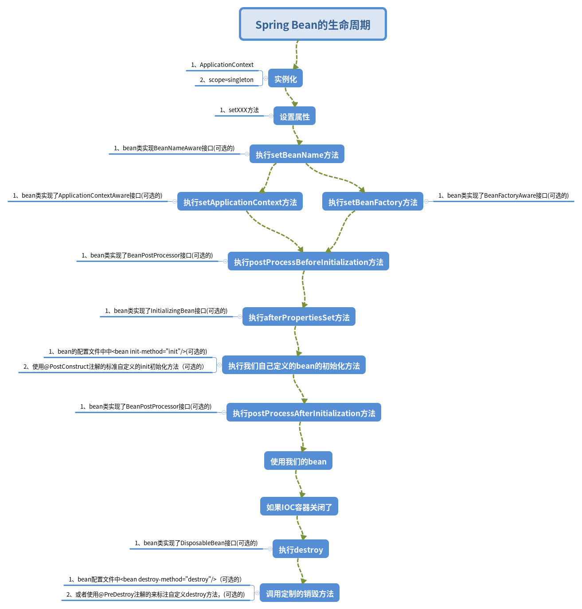

# 一、Spring Bean生命周期

### 1、实例化

- 实例化一个Bean，也就是我们常说的new

### 2、IOC依赖注入

- 按照ApplicationContext上下文对实例化的Bean进行配置，也就是IOC注入

### 3、setBeanName实现

- 如果这个Bean已经实现了BeanNameAware接口，会调用它实现的setBeanName(String id)方法，传递的就是<font color=red>Spring配置文件中的Bean的id值</font>

### 4、BeanFactoryAware实现

- 如果这个Bean已经实现了BeanFactoryAware接口，会调用它实现的setBeanFactory(BeanFactory)传递的是Spring工厂自身。可以用这个方式来获取其他Bean只需要在Spring配置文件中配置一个普通的Bean就可以。

### 5、ApplicationContextAware实现

- 如果这个Bean已经实现了ApplicationContextAware接口，会调用setApplicationContext(ApplicationContext)方法，传入Spring上下文。比步骤4更好点，因为ApplicationContext是BeanFactory的子接口，有更多的实现方法。

### 6、postProcessBeforeInitialization接口实现-初始化预处理

- 如果这个Bean关联了BeanPostProcessor接口，将会调用postProcessBeforeInitialization(Object obj,String s)方法，BeanPostProcessor经常被用来是Bean内容的更改，并且由于这个是在Bean初始化结束时调用的方法，可以被应用在内存或者缓存技术

### 7、init-method

- 如果Bean在Spring配置文件中配置了init-method属性会自动调用其配置的初始化方法。对应的<font color=red>注解是@PostConstruct</font>

### 8、postProcessAfterInitialization

- 如果这个Bean关联了BeanPostProcessor接口，将会调用postProcessAfterInitialization(Object obj,String s)方法。以上工作完成以后，就可以应用这个Bean了，那这个Bean是一个Singleton单例的，所以一般情况下我们调用同一个id的Bean会是在内容地址相同的实例，当然可以在Spring配置文件中Bean的作用范围为ProtoType，GlobalSession等非Singleton。

### 9、Destroy过期自动清理阶段

- 当Bean不在需要的时候，会经过清理阶段，如果Bean实现了DisposableBean这个接口，会调用destroy()方法。

### 10、destroy-method自配置清理

- 如果这个Bean的Spring配置中配置了destroy-method属性，会自动调用它配置的销毁方法。对应的<font color=red>注解是@PreDestroy</font>

### 11、总结



bean的配置文件中，bean标签有2个重要属性

```xml
<bean id="person" class="com.bean.Person" init-method="init" destroy-method="destroy"/>
```

- init-method

  对应的注解为@PostConstruct

- destroy-method

  对应的注解为@PreDestroy

# 二、Spring依赖注入4种方式

### 1、构造方法注入

```java
public PersonServiceImpl(String name){
    this.name=name;
}
```

```xml
<bean id="personServiceImpl" class="com.service.impl.PersonServiceImpl">
	<constructor-arg value="name"></constructor-arg>
</bean>
```

### 2、setter方法注入

```java
public class Person{
    private String name;
    public String getName(){
        return name;
    }
    public void setName(String name){
        this.name=name;
    }
}
```

```xml
<bean id="person" class="com.bean.Person">
	<property name="name" value="tom"></property>
</bean>
```

### 3、静态工厂注入

静态工厂，就是通过静态工厂的方法来获取自己需要的对象，为了让Spring管理所有对象，我们不能直接通过"类.静态方法()"的方式来获取对象，仍然是通过Spring注入的形式获取

```java
//静态工厂
public class ServiceFactory{
    public static final PersonService getStaticServieFactoryImpl(){
        return new StaticFactoryServiceImpl();
    }
}

public class PersonController{
    //注入的对象
    private PersonService staticFactory;
    //注入对象的set方法
    public void setStaticFactoryService(ServiceFactory factory){
        this.staticFactory=factory;
    }
}
```

```xml
<bean name="personController" class="com.controller.PersonController">
    <!--使用静态工厂的方法注入对象，对应下面的配置文件-->
	<property name="staticFactory" ref="factory"></property>
</bean>
<!--用来获取对象的方式，从工厂类中获取静态方法,factory-method用来指定调用哪个工厂方法-->
<bean name="factory" class="com.service.ServiceFactory" factory-method="getStaticServiceFactoryImpl"></bean>
```

### 4、实例工厂

实例工厂就是获取对象的方法不是静态的，需要先new工厂类。再调用普通实例的方法

```java
public class FactoryService{
    public FactoryDao getFactoryDaoImpl(){
        return new FactoryDaoImpl();
    }
}

public class PersonController{
    private FactoryDao factoryDao;
    public void setFactoryDao(FactoryDao dao){
        this.factoryDao=dao;
    }
}
```

```xml
<bean nam="personController" class="com.controller.PersonController">
    <!--使用实例工厂的方法注入对象，对应配置如下-->
	<property name="factoryDao" ref="factoryDao"></property>
</bean>
<!--获取对象的方式从工厂类中获取实例方法-->
<bean name="daoFactory" factory-bean="daoFactory" factory-method="getFactoryDaoImpl"></bean>
```

