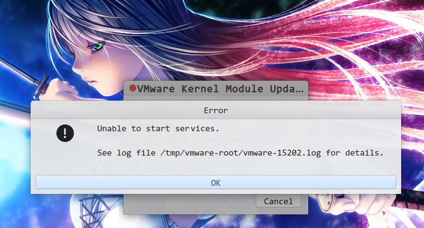

# 一、Ubuntu安装Vmware

```shell
cd ~/下载/软件安装包
#赋予可执行权限
sudo chmod +x VMware-Player-15.1.0-13591040.x86_64.bundle
#安装
sudo ./VMware-Player-15.1.0-13591040.x86_64.bundle
#创建虚拟机的时候，如果遇到vmmode is defined表示没有这个模块
#还需要在bios设置，把secure boot设置为disabled
sudo vmware-modconfig --console --install-all
sudo apt-get install libcanberra-gtk-module
#当vmware报错为Cannot open /dev/vmmon: No such file or directory. Please make sure that the kernel module `vmmon' is loaded
#设置秘钥
openssl req -new -x509 -newkey rsa:2048 -keyout MOK.priv -outform DER -out MOK.der -nodes -days 36500 -subj "/CN=VMware/"
#然后在内核装
sudo /usr/src/linux-headers-`uname -r`/scripts/sign-file sha256 ./MOK.priv ./MOK.der $(modinfo -n vmmon)
#安装MOK
sudo /usr/src/linux-headers-`uname -r`/scripts/sign-file sha256 ./MOK.priv ./MOK.der $(modinfo -n vmnet)
mokutil --import MOK.der
```

# 二、打开Vmware发现报错

#### 1.、Ubuntu解决vmware Unable  to start services



分析原因：由于Ubuntu18.04更新升级模块导致，所以需要下载对应VmWare版本的模块。

#### 2、shell脚本下载对应模块

```shell
#!/bin/bash
#workstation-15.1.0，我自己用的版本是15.1.0的，所以跟写这个版本，然后才能从github下载对应版本的模块信息。
VMWARE_VERSION=workstation-15.1.0 #This needs to be the actual name of the appropriate branch in mkubecek's GitHub repo for your purposes
TMP_FOLDER=/tmp/patch-vmware
rm -fdr $TMP_FOLDER
mkdir -p $TMP_FOLDER
cd $TMP_FOLDER
git clone https://github.com/mkubecek/vmware-host-modules.git #Use `git branch -a` to find all available branches and find the one that's appropriate for you
cd $TMP_FOLDER/vmware-host-modules
git checkout $VMWARE_VERSION
git fetch
make
sudo make install
sudo rm /usr/lib/vmware/lib/libz.so.1/libz.so.1
sudo ln -s /lib/x86_64-linux-gnu/libz.so.1 /usr/lib/vmware/lib/libz.so.1/libz.so.1
systemctl restart vmware && vmware &
```

