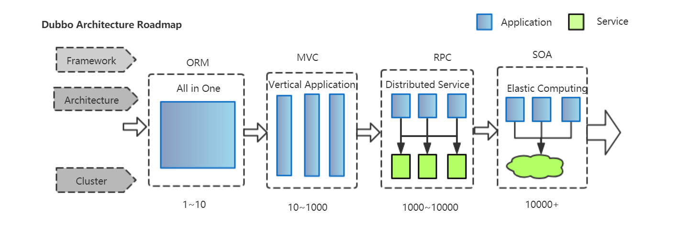
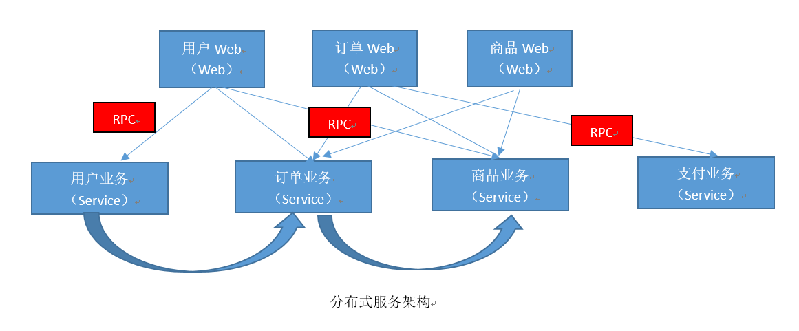
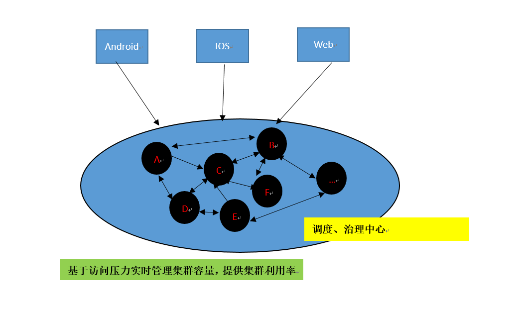
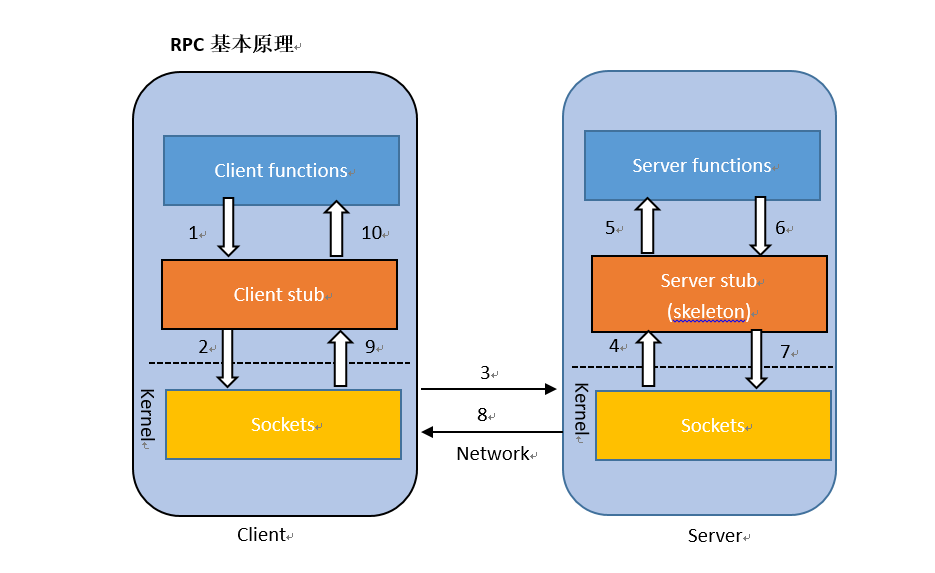

# 一、基础知识

## 1、分布式基础理论

### 1、什么是分布式系统？

《分布式系统原理与范型》定义：

分布式系统是若干独立计算机的**集合**，这些计算机对于用户来说就像**单个相关系统**。

分布式系统(distributed system)是建立在**网络**之上的软件系统

eg：比如我们在使用京东商城进行购物的时候，我们登陆京东商城完成整个购物。对于我们的用户使用来说，我们体会到的是一个完整的京东商城系统。实际上京东商城后面有成千上万台独立的计算机为我们提供服务。这些所有计算机合起来它构成了一个完整的京东商城系统。京东商城它是一个分布式系统。

### 2、为什么要有分布式系统？

随着互联网的发展，网站应用的规模不断扩大，常规的垂直应用架构已经无法应对，分布式服务架构以及流动计算架构势在必行，亟需**一个治理系统**确保架构有条不紊的演进。

eg：比如我们的应用是淘宝级别的，可能没有任何一台服务器能抵挡得住像双11那么大的用户量，每秒要处理几十万的数据。有几个亿的实时数据处理。面对这种情况怎么办呢？我们既然有一个超大型系统，把这个大型系统划分成一个个的小功能模块，把这些功能模块分布在各个计算机上，那这么多的计算机就合起来组成一个完整的系统为我们提供服务。这就是我们分布式的架构思想。毕竟三个臭皮匠，顶个诸葛亮，这么多的计算机合起来就能抵御住非常大的流量。在这种情况下，我们把大型系统，分成一个个小模块(小服务)。而这些小模块(小服务)之间也有着千丝万缕的关系。比如A可能要用到B。而B呢可能要用到C，C可能要用到D，D回过头又得用到B等等。这么复杂的关系我们亟需要一个治理系统来维护我们这个复杂的关系，保证我们系统有条不紊的进行。而我们的Dubbo就能维护和治理这些复杂的关系。那么有了dubbo，我们就能轻而易举的使用分布式的思想来架构我们一个应用。

### 3、应用架构的发展演变

- **单一应用架构**

  当网站流量很小时，只需要一个应用，将所有功能都部署在一起，以减少部署节点和成本。此时，用于简化增删改查工作量的数据访问框架(ORM)是关键。

  比如：超市的收银系统，公司的一些管理系统，一些小型的网站应用等等。比如我们有一个小型的购物网站，它只能少量的人来提供服务，流量很小。比如网站里面有非常多的功能：用户，商品，订单。由于我们网站访问量还是很小的，我们没必要把它做成一个大型的分布式应用。所以说，我们可以将所有的功能都放在一个应用里面。然后将整个应用打包部署放在服务器里。开发简单，部署也简单。某一天网站的访问量大，服务器受不了了。我们可以再来一个服务器，同样都来跑这个应用。两个服务器一起来分担流量压力。

  但是单一应用会带来一些缺点：1、扩展不容易，比如某个功能模块修改了，我们要把整个应用重新打包部署到服务器上。服务器如果有多台，我们就扩展不容易。2、我们协同开发也不容易，大家都去改这一个应用，可能都会改乱，不利于我们应用的维护。

- 垂直应用架构

  当我们的应用规模不断扩大。比如我们以前的应用只要10Mb

  我们应用不断扩大到了500Mb，还是单体应用放在一个服务器里面。单台服务器跑这么大的应用，压力也是很大，光靠增加每一个服务器，已经不能带来性能上的极大提升了。那么接下来就要重新考虑一下我们应用的架构方式。我们就来到第二阶段，叫垂直的应用架构(Vertical Application)。

  我们可以将那么大的单体应用，垂直拆分成几个互不相干的小应用。这些小应用独立部署在每一个服务器上。哪一个小应用的功能增加了，我们只改这些小应用，包括这些小应用流量很大了，我们把它多放在几台服务器上。垂直拆分的好处：

  1、我们分工合作很容易，每一个人负责开发和维护不同的应用。这样就互不干扰。

  2、性能扩展也是很容易的，比如我们的用户应用访问量增大了。我们就把它多复制上几份放到几台服务器上。我们三五台服务器上一起来跑。我们扩展是很容易的。不像是之前的单体应用，一扩展就带上整个应用。我们只是扩展小应用，想要扩展哪一部分就扩展这一个应用就行了，其他的应用先不用动。但是呢？即使是这样的架构也是有一些缺点的：因为每一个小的应用都是完整的，包含界面，业务逻辑，数据库等等。但是呢？我们市场上对界面的要求会经常发生变化，美工天天会改这个页面，一个页面一改，我们整个应用都要重新部署，现在没法做到：1、界面和业务逻辑的实现分离。2、我们应用后来也会增多。垂直应用从用户模块，商品模块，订单模块，增多到支付模块，物流模块等等，这种情况下，我们不能理想情况下，让应用跟应用直接会互相独立。我们的订单可能会用到用户，因为我们创建订单的时候，可能会访问到用户，包括订单还要用到商品的信息。而物流，支付可能会用到订单的一些内容。我们会发现，应用与应用之间可能会进行交互。

  3、应用不可能完全的独立。大量的应用之间需要交互。

  接下来我们怎么办呢？可以采取分布式的应用架构(Distributed Service)，当我们的垂直应用越来越多，应用之间还会进行交互，我们可以把它们的核心业务单独的抽取出来。

- 分布式服务架构(Distributed Service)

  

  用户的应用抽取出用户的界面web和用户的业务逻辑。订单的界面web和订单的业务逻辑等等。这样做的好处是业务逻辑不变的情况下，我们只想改界面，那界面的服务器重新启动一下，我们的核心的业务逻辑还在其他服务器上。比如我们的用户界面，它要展示我们的用户信息，还要展示商品信息。只需要调对应的服务业务就行了。包括业务之间也可能需要互调。但是现在还要一个最大的问题：我们的用户的Web可能在A服务器上，用户的业务可能放在B服务器上，订单放在C服务器上等。如果我们的A服务器要去调B服务器的功能，我们以前写在一个应用里面，A调B，那直接A调B的方法就行了，我们叫进程内通讯，因为他们都在一个服务器上，都是同一个tomcat,同一个进程内通讯。但是现在我们发现A跟B已经分割两地了，它在两处了，这两处我们代码之间如何互调呢?我们把这个调用称为RPC(远程过程调用)。也就是说分布式应用架构下，最核心的难点是RPC远程过程调用，以及如何拆分业务，提升业务的复用程度，那么此时一个好的**分布式服务框架(RPC)**，帮我们来解决远程过程调用的这个框架，就能极大的简化我们的开发。那么这样的架构就会高枕无忧了吗？随着我们的业务不断增加，我们分拆的服务也越来越多，有成千上万的服务器，再来跑各种不同的服务，而出现的一些资源浪费情况，就尤为严重，比如我们的用户业务，这块的访问量比较小，有100台服务器在跑，而我们的商品业务，它的访问量比较大却只有10台服务器在跑，那我们呢就应该有一个能基于我们访问压力的调度中心，能帮我们实时的来监控这些数据，来动态的调度，提高我们这个系统的资源利用率，你跑的服务器有点多了，我们来减上几台，让更多的服务器取来跑业务量更大的这些业务，这个时候呢，就可以采用流动计算架构(Elastic Computing)。

- 流动计算架构(Elastic Computing)

  	服务调度中心，负责维护服务之间的复杂关系以及实时管理我们整个服务集群。比如说A服务器访问量大了，我给A冬天的多来几台服务器。第一台有100个请求，第二台2个请求，第三台有10000个请求，那么下次进来的时候，就找比较闲的服务器来处理请求，比如第二台，提高我们整个服务集群的利用率。

### 4、RPC

- **什么叫RPC**

  RPC(Remote Procedure Call)：是指远程过程调用，是一种进程间通信方式，它是一种技术思想，而不是规范。它允许程序调用另一个地址空间(通常是共享网络的另一台机器)的过程或者函数。而不是程序员显式的编码这个远程调用的细节。即程序员无论是调用本地的还是远程的函数，本质上编写的调用代码基本相同。

- **RPC基本原理**

  

  过程：A想要调用B服务器的应用，A先跟B服务器在网络建立一个Socket连接，然后将我们要调用B的一些信息，B的哪个方法，包括方法名，用的参数是什么，把这些信息传递给B服务器，然后B服务器上Server stub这个小助手收到这些信息，一看A想要调用我里面的信息，它就将这个方法一调用，包括调这个方法用到的参数，也通过网络传递了过来，那我们调方法的时候也将参数传过去，我们B服务器里面的Server stub将方法调用完，调用完以后，方法会有一个返回值，然后这个返回值也通过网络传输给A，A收到返回值以后，A的client stub小助手把这个返回值给我们Client functions。

  整个RPC的核心：A，B两个服务器之间建立网络之间，它们之间进行通信，这样的话A想要用B里面的服务，就像A给B发送一个请求一样，B的方法将响应的结果，交给A。

### 5、dubbo

​	dubbo是一款高性能、轻量级的开源Java RPC框架，提供了三大核心能力：面向接口的远程方法调用，智能容错和负载均衡，以及服务自动注册和发现。

​	register：服务注册中心。

​	provider：服务提供者

​	consumer：服务消费者，消费我们提供的服务。

​	container：指的是dubbo框架容器。

​	monitor：是监控中心，服务提供者provider，服务消费者的一些监控信息都会发到监控中心。

### 6、zookeeper注册中心

### 7、dubbo的Monitor监控中心

[GitHub地址](https://github.com/apache/incubator-dubbo-admin)

然后用mvn clean package打成一个jar包，然后在控制台用java -jar的命令启动就行。

注意：启动监控中心，之前必须启动zookeeper，否则，导致监控中心失败。

