# 一、分布式锁

### 1、为什么要使用分布式锁

​	如果需要对一个共享变量进行多线程同步访问的时候，可以使用java多线程进行运行。

​	如果是单机应用，也就是所有的请求都会分配到当前服务器的JVM内部，然后映射为操作系统的线程进行处理，而这个共享变量只是在这个JVM内部的一块内存空间。

​	后续业务发展，需要做集群，一个应用需要部署好几台机器然后做负载均衡。

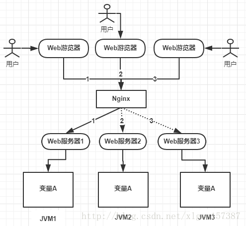

一个共享变量A，存在JVM1，JVM2，JVM3，这3个JVM内存中，这个变量A主要体现是在一个类中的一个成员变量，是一个有状态的对象。

比如UserController中的一个int类型的成员变量。如果不加任何控制的话，变量A同时都会在JVM分配一块内存，3个请求发过来，同时对这个变量操作，显然结果是不对的。即使不是同时发过来，3个请求分别操作3个不同JVM内存区域的数据，变量A之间不共享的话，也不具有可见性的话，处理结果也是不对的。

### 2、解决问题

​	为了保证一个方法或者属性在高并发情况下的同一时间只能被同一个线程运行，在传统单体应用单机部署的情况下，可以使用Java并发处理相关的API（比如ReentrantLock，Synchronized）进行互斥控制。在单机环境中，Java中提供了很多并发处理的API。但是随着业务发展的需要，原来的单机部署的系统被演化为分布式集群系统后，由于分布式系统多线程，多进程并且分布在不同机器上，这将使得原单机部署情况下的并发控制锁策略失效，单纯的Java API并不能呢提供分布式锁的能力。为了解决这个问题就需要一种跨JVM的互斥机制来控制共享资源的访问，这就是分布式锁要解决的问题。

### 3、分布式锁具备的条件

- 在分布式系统环境下，一个方法在同一时间只能被一个机器的一个线程执行。
- 高可用的获取锁与释放锁
- 高性能的获取锁与释放锁
- 具备可重入特性
- 具备锁失效机制，防止死锁
- 具备非阻塞锁特性，也就是没有获取到锁将直接返回获取锁失败。

### 4、分布式锁的3种实现方式

​	目前大型网站应用都是分布式部署，分布式场景中的数据一致性问题一直是一个重要的问题。出现了CAP定理。任何一个分布式系统都无法同时满足一致性(Consistency)，可用性(Availablility)，分区容忍性(Partition tolerance)，只能同时满足2个。

​	目前在绝大多数场景中，都是需要牺牲强一致性来换取系统的高可用性，系统往往只需要保证最终一致性就行。也就是只要这个最终时间是在用户可以接受的范围内就行。

​	在很多场景中，我们为了保证数据的最终一致性，需要很多技术支持。比如分布式事务，分布式锁。需要保证一个方法在同一个时间内只能被同一个线程执行。

- 基于数据库实现分布式锁
- 基于缓存Redis等，实现分布式锁
- 基于Zookeeper实现分布式锁

#### 1、基于数据库实现排它锁(互斥锁)

##### 1.1、解决方法1：使用唯一索引约束。

```sql
DROP TABLE IF EXISTS `method_lock`;
CREATE TABLE `method_lock` (
  `id` int(11) unsigned NOT NULL AUTO_INCREMENT COMMENT '主键',
  `method_name` varchar(64) NOT NULL COMMENT '锁定的方法名',
  `update_time` timestamp NOT NULL DEFAULT CURRENT_TIMESTAMP ON UPDATE CURRENT_TIMESTAMP,
  `PRIMARY KEY (`id`),
  UNIQUE KEY `uidx_method_name` (`method_name`) USING BTREE
) ENGINE=InnoDB AUTO_INCREMENT=3 DEFAULT CHARSET=utf8 COMMENT='锁定中的方法';
```

```sql
--获取锁
insert into method_lock(method_name,desc) values('xxxService','methodName';)
```

这种解决方法，对method_name做了唯一性约束，这里如果有多个请求同时提交到数据库的话，数据库会保证只有一个操作可以成功。

##### 1.2、解决方法2：先获取锁的信息，然后更新状态。

```sql
DROP TABLE IF EXISTS `method_lock`;
CREATE TABLE `method_lock` (
  `id` int(11) unsigned NOT NULL AUTO_INCREMENT COMMENT '主键',
  `method_name` varchar(64) NOT NULL COMMENT '锁定的方法名',
  `state` tinyint NOT NULL COMMENT '1:未分配；2：已分配',
  `update_time` timestamp NOT NULL DEFAULT CURRENT_TIMESTAMP ON UPDATE CURRENT_TIMESTAMP,
  `version` int NOT NULL COMMENT '版本号',
  `PRIMARY KEY (`id`),
  UNIQUE KEY `uidx_method_name` (`method_name`) USING BTREE
) ENGINE=InnoDB AUTO_INCREMENT=3 DEFAULT CHARSET=utf8 COMMENT='锁定中的方法';
```

```sql
--先获取锁的信息
select id,method_name,state,version from method_lock where state=1 and method_name='methodName';
--占有锁
update method_lock set state=2,version=2,update_time=now()
where method_name='methodName' and state=1 and version=2;
--如果没有更新影响到的这一行数据，说明这个资源已经被别人占位了。
```

##### 1.3、这2种方案都是有弊端

- 缺点：
  - 这把锁很依赖数据库的可用性，如果数据库是单个节点，一旦数据库挂了，则业务系统不可用了。
  - 这把锁还没有失效时间，一旦解锁失败(更新state状态失败)，就会导致锁记录一直在数据库中，其他线程无法获取锁。
  - 这把锁是非阻塞的，因为数是insert操作，一旦插入失败就会直接报错，没有获取锁的线程就不会进入到等待队列，要想再次获取锁就必须再次触发获取锁的操作。
  - 这把锁是不可重入的，同一个线程在没有释放锁之前无法再次得到这个所，因为数据已经在数据库中存在了。

- 解决方案：
  - 数据库是单点的话，可以数据库集群，然后数据之前进行同步，一旦挂掉，快速切换到备份库上。
  - 没有失效时间，可以搞一个定时任务，每隔一段时间把数据库中的超时的数据delete。
  - 他是非阻塞的，可以搞一个while循环，直到insert成功后再返回。
  - 它是不可重入的，可以在数据库表上加一个字段，记录当前获取锁的机器的主机信息和线程信息，那么下次获取锁的时候可以先查询数据库，如果当前及其的主机信息和线程信息在数据库可以查到的话，直接把锁分配给他就行了。

#### 2、基于Redis实现分布式锁

```shell
## 获取锁使用的命令：
SET resource_name_value NX PX 30000
```

```JAVA
    @Autowired
    private RedisTemplate redisTemplate;
    
    private static final String LOCK="distribute_key";

    public boolean test(String lockKey){
        Boolean lock=false;
        /**
         * 加锁的时候，在try块中，尝试获取锁，在finaly块中释放锁。
         */
      try {
          //如果key不存在，则新增，如果存在则不改变已经有的值
          lock = redisTemplate.opsForValue().setIfAbsent(lockKey, LOCK);
          log.info("test方法是否获取到锁：" + lock);
          if (lock) {
              //todo 业务逻辑
              redisTemplate.expire(lockKey, 1, TimeUnit.MINUTES);
              return true;
          } else {
              log.info("test方法没有获取到锁，不执行任务！");
          }
      }finally {
          if(lock){
              redisTemplate.delete(lockKey);
              log.info("test方法任务结束，释放锁！");
          }else{
              log.info("test方法没获取到锁，不需要释放锁！");
          }
          return false;
      }
    }
```

##### 2.1、弊端

首先是这主从结构存在明显的竞争状态：

客户端A从master获取到锁，在master将锁同步到slave之前，master挂掉了，slave节点被晋级为master节点，客户端B取的了同一个资源被客户端A已经获取到的另外一个锁。安全失效。

#### 3、基于Zookeeper实现

​	Zookeeper中有节点的概念，Zk的数据存储结构就像一棵树，这棵树由节点组成，节点叫Znode，有点类似Linux的文件系统结构。

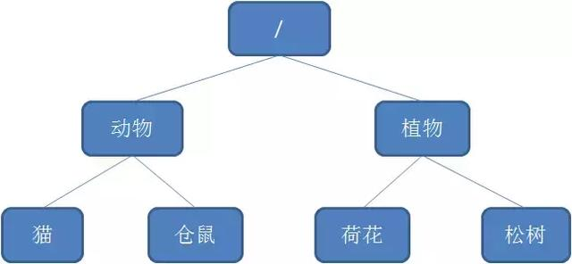

​	Znode有4种类型：

- 持久节点Persistent

  默认的节点类型，创建节点的客户端与zk断开连接后，这个节点仍然存在。

- 持久节点顺序节点Persistent_Sequential

  顺序节点，就是在创建节点的时候，zk根据创建的时间顺序给该节点名称进行编号。

  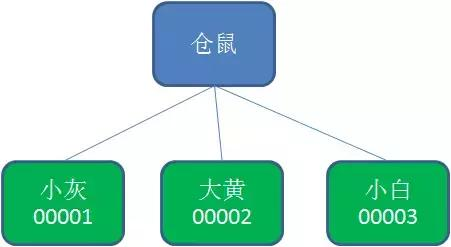

- 临时节点Ephemeral

  和持久节点相反，当创建节点的客户端与zk断开后，临时节点会被删除。

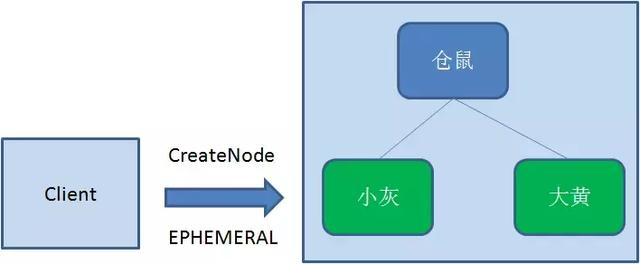


- 临时顺序节点（Ephemeral_Sequential）

  临时顺序节点就是结合了临时节点和顺序节点的特点：在创建临时节点的时候，zk根据创建的时间顺序给节点名称进行编号，当创建节点的客户端与zk断开连接后，临时顺序节点被删除。

##### 3.1、Zookeeper分布式锁的原理

Zk分布式锁使用的是临时顺序节点，也就是客户端断开连接后，会删除该节点，然后客户端创建节点的时候，会按照时间顺序来对临时节点命名。

- 获取锁

  - 首先在zk中创建一个持久节点ParentLock，当第一个客户端想要获取锁的时候，需要在ParentLock这个节点下面创建临时顺序节点Lock1。

  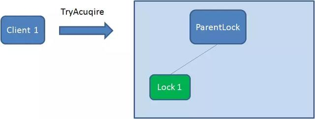

  

  - Client1查找ParnentLock下面所有的临时顺序节点并排序，然后判断自己创建的节点Lock1是不是顺序最靠前的一个节点。如果是第一个节点，就成功获取锁。

  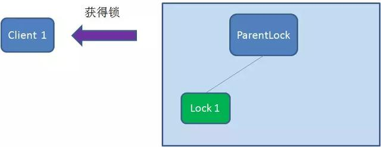

  - 这个时候，再有一个客户端Client2前来获取锁，首先在ParentLock下再创建一个临时顺序节点Lock2

  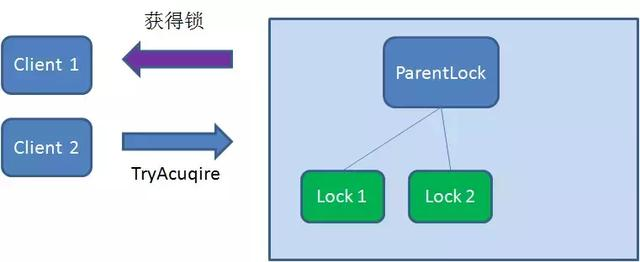

  - Client2查找ParnentLock下面所有的临时顺序节点并排序，判断它自己创建的节点Lock2是不是顺序最靠前的一个，结果发现节点Lock2并不是最小的。于是，Client2向排序仅仅比他靠前的节点Lock1注册Watcher，用来监听Lock1节点是否存在。这意味者此时Client2抢锁失败，进入了等待状态。

  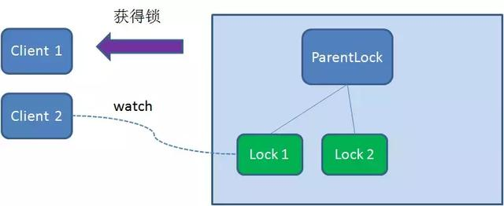

  - 假如这个时候，又有一个客户端Client3前来获取锁，则在ParentLock下再创建一个临时顺序节点Lock3

  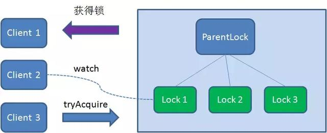

  - Client3查找ParentLock下面所有的临时顺序节点并排序，判断自己所创建的节点Lock3是不是顺序最靠前的一个，结果同样发现节点Lock3并不是最小的。

    于是，Client3向排序仅仅比他靠前的节点Lock2注册Watcher，用来监听Lock2节点是否存在，这意味这Client3同样抢锁失败，进入了等待状态。

    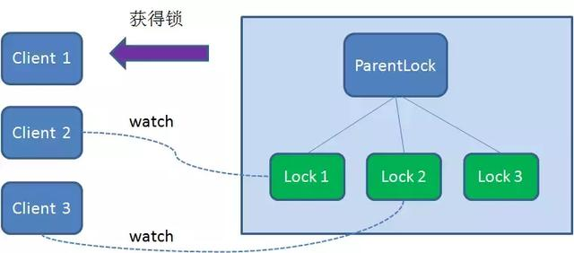

  - 这样就形成了，Client1获取了锁，Client2监听了Lock1，Client3监听额Lock2。从而形成了一个等待队列，很像Java中ReentrantLock所依赖的。

- 释放锁

  - 1、任务完成，客户端显示释放

    当任务完成后，Client1会显示调用删除节点Lock1的指令。

    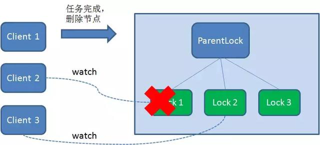

  - 2、任务执行过程中，客户端崩溃

    得到锁的Client1在执行任务过程中，突然挂了，则会断开与Zk服务端的连接，根据临时节点的特性，它自己创建的节点也会被自动删除。

    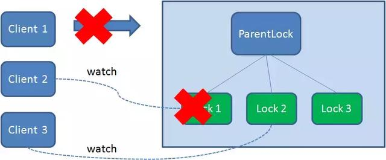

    由于Client2一直监听者Lock1的存在状态，当Lock1节点被删除后，Client2会立刻得到通知，这时候Client2会再次查ParentLock下面的所有节点，确认自己创建的节点Lock22是不是目前最小的节点，如果是最小，则Client2就成功获取了锁。

    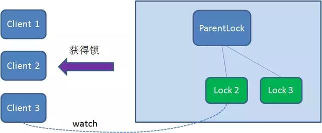

    同理，如果Client2也因为任务完成或者节点崩溃而删除了Lock2，那么Client3会收到通知。

    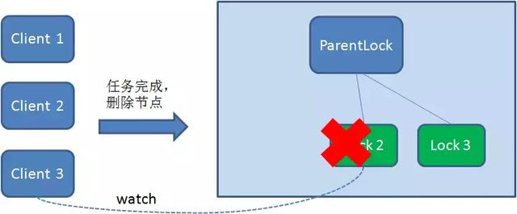

    最终，Client3成功获取锁。

##### 3.2、实现方法

可以直接使用zk第三方库Curator客户端，这个客户端封装了一个可重入的锁服务。

```java
/**
     * InterProcessMutex是分布式锁的实现，acquire方法用户获取锁，release释放锁
     */
    @Autowired
    private InterProcessMutex interProcessMutex;
    
    public boolean tryLock(long timeout,TimeUnit unit){
        
        try {
            interProcessMutex.acquire(timeout,unit);
        } catch (Exception e) {
            e.printStackTrace();
        }
        return true;
    }
    @Autowired
    private ExecutorCompletionService executorService;
    public boolean unLock(){
        try {
            interProcessMutex.release();
        } catch (Exception e) {
            e.printStackTrace();
        } finally {
            //executorService.schedule(new Cleaner(client,path),delayTimeForClean,TimeUnit.MILLISECONDS);
        }
        return true;
    }
```

- 缺点：

  ​	性能上，并没有缓存那么高，因为每次在创建锁和释放锁的过程中，都需要动态创建按，销毁临时顺序节点来实现锁功能。zk中创建和删除节点只能通过leader服务器来执行，然后将数据同步到所有的follwer服务器上。

  ​	使用zk也有可能带来并发问题，只是并不常见。由于网络抖动，客户端与zk集群的session连接断了，那么zk以为客户端挂了，就会删除临时节点，这时候其他客户端就可以获取到分布式锁了。也有可能产生并发问题，并不常见，因为zk有重试机制，一旦zk集群检测不到客户端的心跳，你就会重试，Curator客户端（操作zk的客户端）支持多种重试策略	，多次重试之后还是不行的话，就会删除临时节点。因此，选择一个合适的重试策略也很重要，要在锁的粒度和并发之前找一个平衡。

### 5、总结

| 分布式锁 |                             优点                             |                             缺点                             |
| :------: | :----------------------------------------------------------: | :----------------------------------------------------------: |
|    Zk    | 1、有封装好的框架，容易实现。2、有等待锁的队列，大大提升抢锁效率。 |                   添加和删除节点性能比较低                   |
|  Redis   |                   Set和Del执行的性能比较高                   | 1、实现复杂，需要考虑超时，原子性，误删的情况。2、没有等待锁的队列，只能在客户端自旋来等待，效率比较低。 |

### 6、3种方案比较使用

3种方法，就如同CAP一样，在复杂性，可靠性，性能等方面无法同事满足。应该根据不同应用场景，选择最合适的分布式锁。

#### 6.1、从理解的难易程度上，从低到高

数据库------->Redis------->Zk

#### 6.2、从实现的复杂程度上，从低到高

zk------------->Redis------->数据库

#### 6.3、从性能角度，从低到高

数据库-------------->zk--------->Redis

#### 6.4、从可靠性角度，从低到高

zk--------------->Redis--------------->数据库