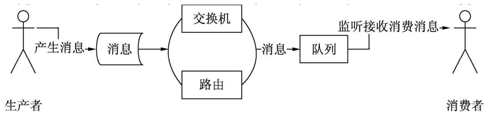
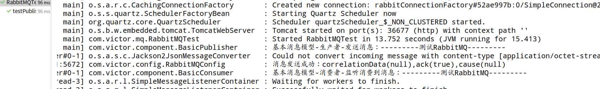
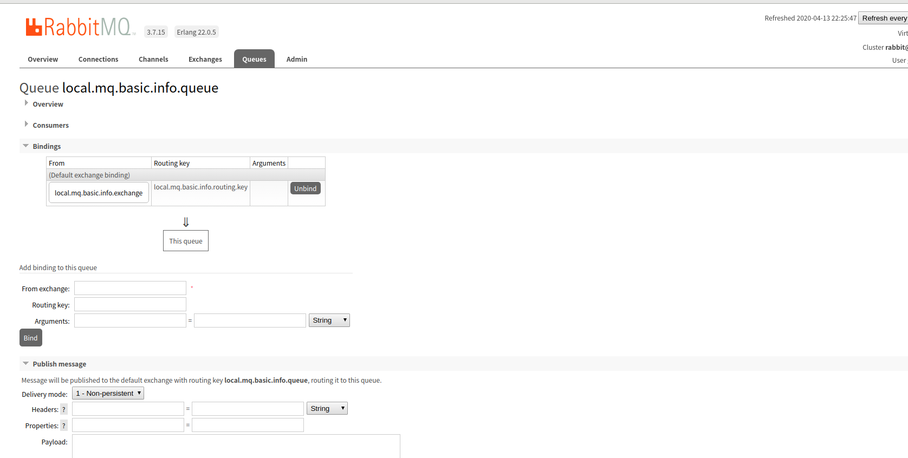
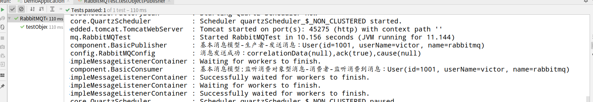
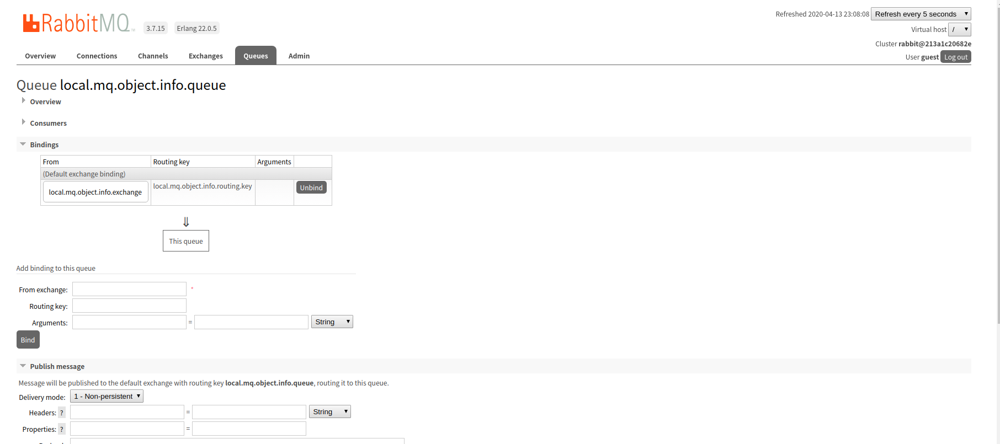

# 一、消息中间件RabbitMQ(一)

## 1、RabbitMQ常用词汇介绍

### 1.1、RabbitMQ包括生产者、消费者、消息、队列、交换机、路由等基础组件

- 生产者Producer：用来产生、发送消息的程序
- 消费者Consumer：用来监听、接收、消费和处理消息的程序
- 消息：看做实际的数据，消息是通过二进制的数据流进行传输的，这点和Redis很像
- 队列：消息的存储区，看做一个中转站，消息经过中转站后，将消息传输到消费者
- 交换机：也可看做消息的中转站，用来首次接收和分发消息，包括Headers，Fanout，Direct，Topic这4种。
- 路由：相当于地址，通常和交换机绑定在一起，将消息路由到指定的队列。

### 1.2、RabbitMQ消息模型有多种

- 基于HeadersExchange的消息模型

- 基于FanoutExchange的消息模型
- 基于DirectExchange的消息模型
- 基于TopicExchange的消息模型

- 消息模型都有一个特点，它们基本上都包含交换机、路由、队列

### 1.3、RabbitMQ的基本消息模型图



## 2、Springboot整合RabbitMQ

### 2.1、引入RabbitMQ的依赖

```xml
        <!--springboot整合RabbitMQ-->
        <dependency>
            <groupId>org.springframework.boot</groupId>
            <artifactId>spring-boot-starter-amqp</artifactId>
        </dependency>
```

### 2.2、application.properties配置文件配置RabbitMQ

```yaml
#rabbitmq
spring.rabbitmq.host=localhost
spring.rabbitmq.port=5672
spring.rabbitmq.username=guest
spring.rabbitmq.password=guest
mq.env=local
#定义基本消息模型中队列、交换机、路由的名称
mq.basic.info.queue.name=${mq.env}.mq.basic.info.queue
mq.basic.info.exchange.name=${mq.env}.mq.basic.info.exchange
mq.basic.info.routing.key=${mq.env}.mq.basic.info.routing.key
```

## 3、基于DirectExchange的消息模型

### 3.1、字节类型消息

#### 1、自定义注入配置RabbitMQConfig

```java
package com.victor.config;


import lombok.extern.slf4j.Slf4j;
import org.springframework.amqp.core.*;
import org.springframework.amqp.rabbit.config.SimpleRabbitListenerContainerFactory;
import org.springframework.amqp.rabbit.connection.CachingConnectionFactory;
import org.springframework.amqp.rabbit.core.RabbitTemplate;
import org.springframework.amqp.support.converter.Jackson2JsonMessageConverter;
import org.springframework.beans.factory.annotation.Autowired;
import org.springframework.boot.autoconfigure.amqp.SimpleRabbitListenerContainerFactoryConfigurer;
import org.springframework.context.annotation.Bean;
import org.springframework.context.annotation.Configuration;
import org.springframework.core.env.Environment;

import java.util.Objects;

/**
 * @Description:
 * @Author: VictorDan
 * @Version: 1.0
 */
@Configuration
@Slf4j
public class RabbitMQConfig {
    /**
     * 自动装配RabbitMQ的连接工厂实例
     */
    @Autowired
    private CachingConnectionFactory cachingConnectionFactory;
    /**
     * 自动状态消息监听器所在的容器工厂配置类实例
     */
    @Autowired
    private SimpleRabbitListenerContainerFactoryConfigurer factoryConfigurer;

    /**
     * 读取配置文件的环境变量实例
     */
    @Autowired
    private Environment env;

    /**
     * 单一消费者实例的配置
     * @return
     */
    @Bean(name = "singleListenerContainer")
    public SimpleRabbitListenerContainerFactory listenerContainer(){
        //定义消息监听器所在的容器工厂
        SimpleRabbitListenerContainerFactory factory = new SimpleRabbitListenerContainerFactory();
        //设置容器工厂所有的实例
        factory.setConnectionFactory(cachingConnectionFactory);
        //设置消息在传输中的格式，这里采用Json的格式进行传输
        factory.setMessageConverter(new Jackson2JsonMessageConverter());
        //设置并发消费者实例的初始数量，此处为1
        factory.setConcurrentConsumers(1);
        //设置并发消费者实例中的最大数量，此处设为1
        factory.setMaxConcurrentConsumers(1);
        //设置并发消费者实例中每个实例拉取的消息数量-这里为1
        factory.setPrefetchCount(1);
        return factory;
    }

    /**
     * 多个消费者实例配置，用在高并发业务场景的配置
     * @return
     */
    @Bean(name = "multiListenerContainer")
    public SimpleRabbitListenerContainerFactory multiListenerContainer(){
        //定义消息监听器所在的容器工厂
        SimpleRabbitListenerContainerFactory factory = new SimpleRabbitListenerContainerFactory();
        //设置容器工厂所有的实例
        factoryConfigurer.configure(factory,cachingConnectionFactory);
        //设置消息在传输中的格式，这里采用Json的格式进行传输
        factory.setMessageConverter(new Jackson2JsonMessageConverter());
        //设置消息的确认霞飞模式，这里设置为NONE：不需要确认消费
        factory.setAcknowledgeMode(AcknowledgeMode.NONE);
        //设置并发消费者实例的初始数量，此处为10
        factory.setConcurrentConsumers(10);
        //设置并发消费者实例中的最大数量，此处设为15
        factory.setMaxConcurrentConsumers(15);
        //设置并发消费者实例中每个实例拉取的消息数量-这里为10个
        factory.setPrefetchCount(10);
        return factory;
    }

    /**
     * 自定义配置RabbitMQ发送消息的操作组件RabbitTemplate
     * @return
     */
    @Bean
    public RabbitTemplate rabbitTemplate(){
        //设置为true发送消息后进行确认
        cachingConnectionFactory.setPublisherConfirms(true);
        //设置为true发送消息后返回确认信息
        cachingConnectionFactory.setPublisherReturns(true);
        //构造发送消息组件的rabbitTemplate
        RabbitTemplate rabbitTemplate = new RabbitTemplate(cachingConnectionFactory);
        rabbitTemplate.setMandatory(true);
        //发送消息后，如果发送成功，则输出"消息发送成功"的反馈信息
        rabbitTemplate.setConfirmCallback((correlationData, ack, cause)
                -> log.info("消息发送成功：correlationData({}),ack({}),cause({})",correlationData,ack,cause));
        //发送消息后，如果发送鼠标，则输出”消息丢失“的反馈信息
        rabbitTemplate.setReturnCallback((message, replyCode, replyText, exchange, routingKey)
                -> log.info("消息丢失：exchange({})，route({}),replyCode({}),replyText({}),message({})",
                exchange,routingKey,replyCode,replyText,message));
        return rabbitTemplate;

    }

    //创建简单消息模型：队列、交换机、路由
    /**
     * 创建队列
     * @return
     */
    @Bean(name = "basicQueue")
    public Queue basicQueue(){
        return new Queue(Objects.requireNonNull(env.getProperty("mq.basic.info.queue.name")),true);
    }

    /**
     * 创建交换机：在这里以DirectExchange为例
     * @return
     */
    @Bean
    public DirectExchange basicExchange(){
        return new DirectExchange(env.getProperty("mq.basic.info.exchange.name"),true,false);
    }

    /**
     * 创建绑定
     * @return
     */
    @Bean
    public Binding basicConfig(){
        return BindingBuilder.bind(basicQueue()).to(basicExchange()).with(env.getProperty("mq.basic.info.routing.key"));
    }

}
```

#### 2、消息生产者BasicPublisher

```java
package com.victor.component;

import com.fasterxml.jackson.databind.ObjectMapper;
import com.google.common.base.Strings;
import lombok.extern.slf4j.Slf4j;
import org.springframework.amqp.core.Message;
import org.springframework.amqp.core.MessageBuilder;
import org.springframework.amqp.rabbit.core.RabbitTemplate;
import org.springframework.amqp.support.converter.Jackson2JsonMessageConverter;
import org.springframework.beans.factory.annotation.Autowired;
import org.springframework.core.env.Environment;
import org.springframework.stereotype.Component;

import java.nio.charset.StandardCharsets;
import java.util.Objects;

/**
 * @Description: 基本消息模型-生产者
 * @Author: VictorDan
 * @Version: 1.0
 */
@Component
@Slf4j
public class BasicPublisher {
    @Autowired
    private ObjectMapper objectMapper;

    @Autowired
    private RabbitTemplate rabbitTemplate;

    @Autowired
    private Environment env;

    /**
     * 待发送消息，也就是一串字符串值
     * @param message
     */
    public void sendMsg(String message){
        if(!Strings.isNullOrEmpty(message)){
            try{
                rabbitTemplate.setMessageConverter(new Jackson2JsonMessageConverter());
                //指定消息模型中的交换机
                rabbitTemplate.setExchange(env.getProperty("mq.basic.info.exchange.name"));
                //指定消息模型中的路由
                rabbitTemplate.setRoutingKey(Objects.requireNonNull(env.getProperty("mq.basic.info.routing.key")));
                //将字符串值转化为待发送的消息，也就是一串二进制的数据流
                Message msg= MessageBuilder.withBody(message.getBytes(StandardCharsets.UTF_8)).build();
                //转化并发送消息
                rabbitTemplate.convertAndSend(msg);
                log.info("基本消息模型-生产者-发送消息：{}",message);
            }catch (Exception e){
                log.error("基本消息模型-生产者-发送消息发生异常：{}",message,e.fillInStackTrace());
            }
        }
    }
}
```

#### 3、消费者BasicConsumer

```java
package com.victor.component;

import com.fasterxml.jackson.databind.ObjectMapper;
import lombok.extern.slf4j.Slf4j;
import org.springframework.amqp.rabbit.annotation.RabbitListener;
import org.springframework.beans.factory.annotation.Autowired;
import org.springframework.messaging.handler.annotation.Payload;
import org.springframework.stereotype.Component;

import java.nio.charset.StandardCharsets;

/**
 * @Description: 基本消息模型-消费者
 * @Author: VictorDan
 * @Version: 1.0
 */
@Component
@Slf4j
public class BasicConsumer {
    @Autowired
    private ObjectMapper objectMapper;

    /**
     * 监听并接收消息队列中的消息-这里采用单一容器工厂实例
     * @param msg
     */
    @RabbitListener(queues = "${mq.basic.info.queue.name}",containerFactory = "singleListenerContainer")
    public void consuMsg(@Payload byte[] msg){
        try{
            //将字节数组的消息转化为字符串并打印
            String message=new String(msg, StandardCharsets.UTF_8);
            log.info("基本消息模型-消费者-监听消费到消息：{}",message);
        } catch (Exception e) {
            log.error("基本消息模型-消费者-发生异常：{}",e.getMessage());
        }
    }
}
```

#### 4、单元测试类RabbitMQTest

```java
package com.victor.mq;

import com.victor.AbstractTest;
import com.victor.component.BasicPublisher;
import org.junit.Test;
import org.springframework.beans.factory.annotation.Autowired;

/**
 * @Description:
 * @Author: VictorDan
 * @Date: 19-11-8 上午10:56
 * @Version: 1.0
 */
public class RabbitMQTest extends AbstractTest {

    @Autowired
    private BasicPublisher basicPublisher;
    
    @Test
    public void testPublisher(){
        String msg="---------测试RabbitMQ---------";
        basicPublisher.sendMsg(msg);
    }
}
```

#### 5、RabbitMQ基本消息模型单元测试运行结果



#### 6、RabbitMQ管理后台查看创建的基本消息模型



### 3.2、其他消息类型

- RabbitMQ在实际中，除了发送字节型消息(getBytes()或者序列化)的消息和采用@RabbitListener接收字节数组类型的消息之外，还可接收对象类的方式实现消息的发送和接收。

#### 1、同样引入之前的类User

```java
package com.victor.model;

import lombok.Data;
import lombok.ToString;

import java.io.Serializable;

/**
 * @Description:
 * 1、JavaBean必须要实现Serializable接口，否则在测试使用redis的list的时候会报错
 * 2、报错信息：org.springframework.data.redis.serializer.SerializationException:
 * Cannot serialize; nested exception is org.springframework.core.serializer.support.SerializationFailedException:
 * Failed to serialize object using DefaultSerializer;
 * nested exception is java.lang.IllegalArgumentException:
 * DefaultSerializer requires a Serializable payload but received an object of type [com.victor.model.User]
 * 3、因为Spring会将对象先序列化后再存入Redis
 * @Author: VictorDan
 * @Date: 20-4-9 下午7:54
 * @Version: 1.0
 */
@Data
@ToString
public class User implements Serializable {
    private Integer id;
    private String userName;
    private String name;

    /**
     * 重写构造函数必须要提供无参构造函数，导致JVM不会添加默认的无参构造函数，而jackson的反序列化需要无参构造函数，因此报错。
     */
    public User(){

    }
    public User(Integer id, String userName, String name) {
        this.id = id;
        this.userName = userName;
        this.name = name;
    }
}

```

#### 2、在application.properties配置文件中新增对象类型对应的消息模型名称

```yaml
#处理对象类型消息：定义基本消息模型中队列、交换机、路由的名称
mq.object.info.queue.name=${mq.env}.mq.object.info.queue
mq.object.info.exchange.name=${mq.env}.mq.object.info.exchange
mq.object.info.routing.key=${mq.env}.mq.object.info.routing.key
```

#### 3、在RabbitMQConfig配置类中新建一个新的用来发送对象类型消息的队列、交换机、路由并进行绑定

```java
    //处理对象类型消息：交换机，队列，路由
    /**
     * 创建队列
     * @return
     */
    @Bean(name = "objectQueue")
    public Queue objectQueue(){
        return new Queue(Objects.requireNonNull(env.getProperty("mq.object.info.queue.name")),true);
    }

    /**
     * 创建交换机：在这里以DirectExchange为例
     * @return
     */
    @Bean
    public DirectExchange objectExchange(){
        return new DirectExchange(env.getProperty("mq.object.info.exchange.name"),true,false);
    }

    /**
     * 创建绑定
     * @return
     */
    @Bean
    public Binding objectConfig(){
        return BindingBuilder.bind(basicQueue()).to(basicExchange()).with(env.getProperty("mq.object.info.routing.key"));
    }
```

#### 4、发送对象类型消息的生产者

```java
/**
     * 发送对象类型的消息
     * @param user
     */
    public void sendObjectPublisher(User user){
        if(user!=null){
            try{
                rabbitTemplate.setMessageConverter(new Jackson2JsonMessageConverter());
                //指定消息模型中的交换机
                rabbitTemplate.setExchange(env.getProperty("mq.object.info.exchange.name"));
                //指定消息模型中的路由
                rabbitTemplate.setRoutingKey(Objects.requireNonNull(env.getProperty("mq.object.info.routing.key")));
                //转化并发送消息
                rabbitTemplate.convertAndSend(user, message -> {
                    //获取消息属性
                    MessageProperties messageProperties = message.getMessageProperties();
                    //设置消息的持久化模式
                    messageProperties.setDeliveryMode(MessageDeliveryMode.PERSISTENT );
                    //设置消息的类型，指定为User类对象类型
                    messageProperties.setHeader(AbstractJavaTypeMapper.DEFAULT_KEY_CLASSID_FIELD_NAME,User.class);
                    return message;
                });
                log.info("基本消息模型-生产者-发送消息：{}",user);
            }catch (Exception e){
                log.error("基本消息模型-生产者-发送消息发生异常：{}",user,e.fillInStackTrace());
            }
        }
    }
```

#### 5、接收对象类型消息的消费者

```java
/**
     * 监听并消费队列中的消息-监听消费对象型消息
     * @param user
     */
    @RabbitListener(queues = "${mq.object.info.queue.name}",containerFactory = "singleListenerContainer")
    public void consumeObjectMsg(@Payload User user){
        try{
            log.info("基本消息模型:监听消费对象型消息-消费者-监听消费到消息：{}",user);
        }catch (Exception e) {
            log.error("基本消息模型-消费者-发生异常：{}",e.getMessage());
        }
    }
```

#### 6、对象类型消息测试方法

```java
@Test
    public void testObjectPublisher(){
        User user = new User(1001, "victor", "rabbitmq");
        basicPublisher.sendObjectPublisher(user);
    }
```

#### 7、在控制台查看运行结果



#### 8、在RabbitMQ管理后台查看对象类型消息的队列




## 4、基于HeadersExchange的消息模型

在实际中使用很少，几乎用不到。