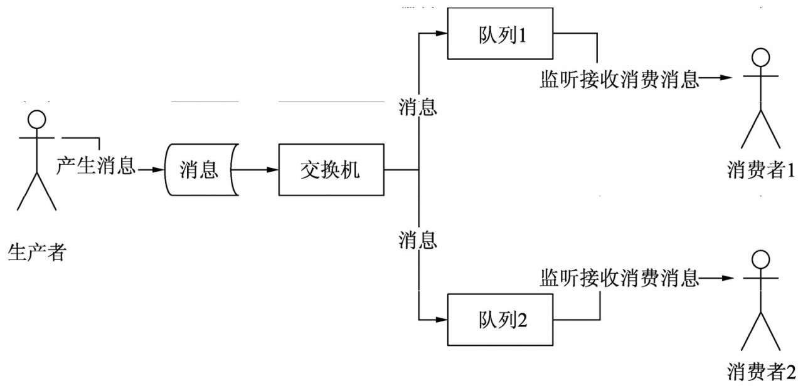
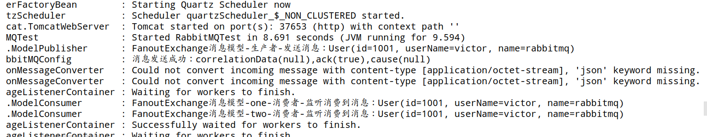
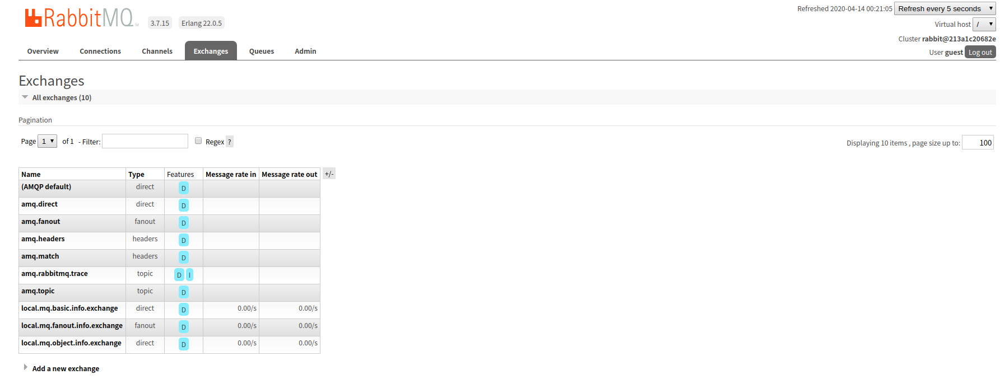
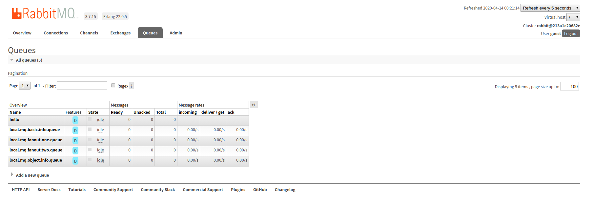

# 二、消息中间件RabbitMQ(二)

## 1、基于FanoutExchange的消息模型

- FanoutExchange是交换机的一种，有广播消息的作用，也就是当消息进入到交换机这个中转站的时候，交换机会检查哪个队列跟自己绑定在一起的。

- 找到队列后，将消息传输到绑定的队列中，然后让队列中的消费者进行监听消费。

- FanoutExchange这种交换机具有广播式的作用，即使绑定了路由也不会起作用，所以不需要根据路由判断绑定到哪个队列。

- 基于FanoutExchange消息模型结构图

  

### 1.1、对象类型消息

- 使用场景：将一个实体对象作为消息，并发送到基于FanoutExchange的消息模型中，最后由绑定的多条队列对应的消费者进行监听消费。

#### 1、在application.properties配置文件中新增FanoutExchange消息模型对应的消息模型名称

```yaml
###############基于FanoutExchange消息模型###############
#处理对象类型消息：定义基本消息模型中队列、交换机、路由的名称
mq.fanout.queue.one.name=${mq.env}.mq.fanout.one.queue
mq.fanout.queue.two.name=${mq.env}.mq.fanout.two.queue
mq.fanout.info.exchange.name=${mq.env}.mq.fanout.info.exchange
```

#### 2、在RabbitMQConfig配置类中新建一个新的用来发送FanoutExchange消息模型的队列、交换机、路由并进行绑定

```java
//基于FanoutExchange交换机消息模型
    //处理对象类型消息：交换机，队列，路由
    /**
     * 创建队列1
     * @return
     */
    @Bean(name = "fanoutQueueOne")
    public Queue fanoutQueueOne(){
        return new Queue(Objects.requireNonNull(env.getProperty("mq.fanout.queue.one.name")),true);
    }

    /**
     * 创建队列2
     * @return
     */
    @Bean(name = "fanoutQueueTwo")
    public Queue fanoutQueueTwo(){
        return new Queue(Objects.requireNonNull(env.getProperty("mq.fanout.queue.two.name")),true);
    }

    /**
     * 创建交换机：在这里以DirectExchange为例
     * @return
     */
    @Bean
    public FanoutExchange fanoutExchange(){
        return new FanoutExchange(env.getProperty("mq.fanout.info.exchange.name"),true,false);
    }

    /**
     * 创建绑定1
     * @return
     */
    @Bean
    public Binding fanoutBindingOne(){
        return BindingBuilder.bind(fanoutQueueOne()).to(fanoutExchange());
    }
    /**
     * 创建绑定2
     * @return
     */
    @Bean
    public Binding fanoutBindingTwo(){
        return BindingBuilder.bind(fanoutQueueTwo()).to(fanoutExchange());
    }
```

#### 3、发送FanoutExchange消息模型的生产者

```java
package com.victor.component.fanoutExchange;

import com.fasterxml.jackson.databind.ObjectMapper;
import com.victor.model.User;
import lombok.extern.slf4j.Slf4j;
import org.springframework.amqp.core.Message;
import org.springframework.amqp.core.MessageBuilder;
import org.springframework.amqp.rabbit.core.RabbitTemplate;
import org.springframework.amqp.support.converter.Jackson2JsonMessageConverter;
import org.springframework.beans.factory.annotation.Autowired;
import org.springframework.core.env.Environment;
import org.springframework.stereotype.Component;

/**
 * @Description:
 * @Author: VictorDan
 * @Version: 1.0
 */
@Component
@Slf4j
public class ModelPublisher {
    @Autowired
    private ObjectMapper objectMapper;

    @Autowired
    private RabbitTemplate rabbitTemplate;

    @Autowired
    private Environment env;

    public void sendMsg(User user){
        if(user!=null){
            try {
                rabbitTemplate.setMessageConverter(new Jackson2JsonMessageConverter());
                //设置FanoutExchange广播式交换机
                rabbitTemplate.setExchange(env.getProperty("mq.fanout.info.exchange.name"));
                //创建消息体
                Message message = MessageBuilder.withBody(objectMapper.writeValueAsBytes(user)).build();
                //转化并发送消息
                rabbitTemplate.convertAndSend(message);
                log.info("FanoutExchange消息模型-生产者-发送消息：{}",user);
            } catch (Exception e) {
                log.error("FanoutExchange消息模型-生产者-发送消息失败：{}",user,e.fillInStackTrace());
            }
        }
    }
}
```

#### 4、接收FanoutExchange消息模型的消费者

```java
package com.victor.component.fanoutExchange;

import com.fasterxml.jackson.databind.ObjectMapper;
import com.victor.model.User;
import lombok.extern.slf4j.Slf4j;
import org.springframework.amqp.rabbit.annotation.RabbitListener;
import org.springframework.beans.factory.annotation.Autowired;
import org.springframework.messaging.handler.annotation.Payload;
import org.springframework.stereotype.Component;

import java.io.IOException;

/**
 * @Description: 消费者
 * @Author: VictorDan
 * @Version: 1.0
 */
@Component
@Slf4j
public class ModelConsumer {
    @Autowired
    private ObjectMapper objectMapper;

    /**
     * 监听并消费队列中的消息-fanoutExchange-one-第1个队列中对应的消费者
     * @param user
     */
    @RabbitListener(queues = "${mq.fanout.queue.one.name}",containerFactory = "singleListenerContainer")
    public void consumeFanoutMsgOne(@Payload byte[] user){
        try {
            User value = objectMapper.readValue(user, User.class);
            log.info("FanoutExchange消息模型-one-消费者-监听消费到消息：{}",value);
        } catch (IOException e) {
            log.error("FanoutExchange消息模型-one-消费者-监听消费消息发生异常：{}",e.getMessage());
        }
    }

    /**
     * 监听并消费队列中的消息-fanoutExchange-Two-第2个队列中对应的消费者@Autowired
    private BasicPublisher basicPublisher;
     * @param user
     */
    @RabbitListener(queues = "${mq.fanout.queue.two.name}",containerFactory = "singleListenerContainer")
    public void consumeFanoutMsgTwo(@Payload byte[] user){
        try {
            User value = objectMapper.readValue(user, User.class);
            log.info("FanoutExchange消息模型-two-消费者-监听消费到消息：{}",value);
        } catch (IOException e) {
            log.error("FanoutExchange消息模型-two-消费者-监听消费消息发生异常：{}",e.getMessage());
        }
    }
}
```

#### 5、FanoutExchange消息模型的测试方法

```java
@Autowired
    private ModelPublisher modelPublisher;

@Test
    public void testModelPublisher(){
        User user = new User(1001, "victor", "rabbitmq");
        modelPublisher.sendMsg(user);
    }
```

#### 6、在控制台查看FanoutExchange消息模型运行结果



#### 7、在RabbitMQ管理后台查看FanoutExchange消息模型的队列和交换机

- 查看交换机



- 查看队列



## 2、总结

- 基于FanoutExchange消息模型主要的核心组件是交换机和队列，一个交换机可以对应并绑定多个队列，从而对应多个消费者。
- FanoutExchange消息模型适用于业务数据需要广播式传输的场景，比如用户操作写日志
  - 当用户在系统中做了某种操作后，需要在业务系统中将用户的操作内容写入到数据库
  - 同时还需要单独将用户的操作内容传输到日志系统进行存储，以便后续进行日志分析
  - 可以将用户的操作日志封装成实体对象，将它序列化为JSON数据当消息，然后采用FanoutExchange广播式交换机发送、接收、处理。