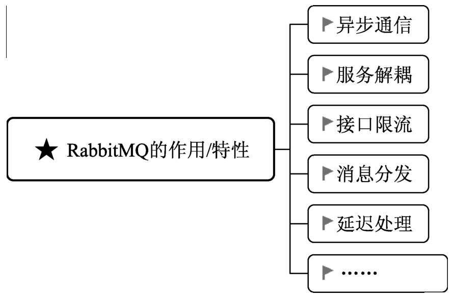
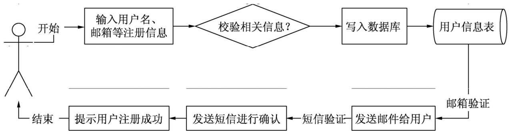
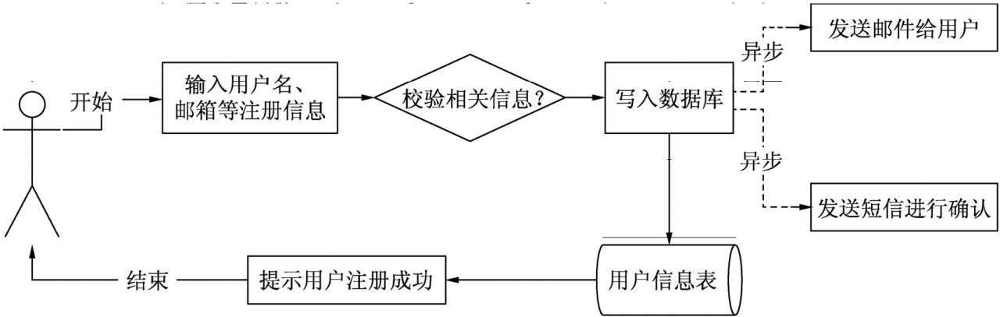
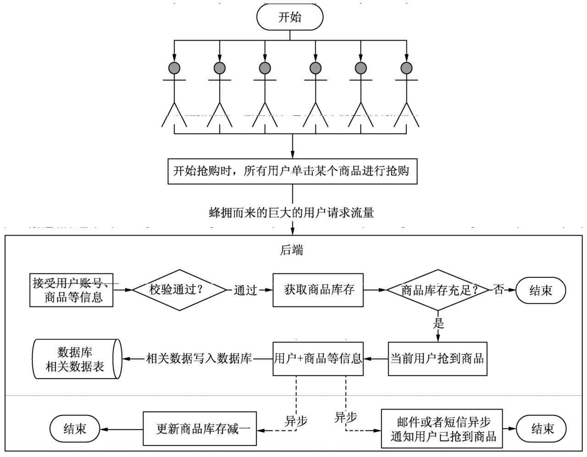
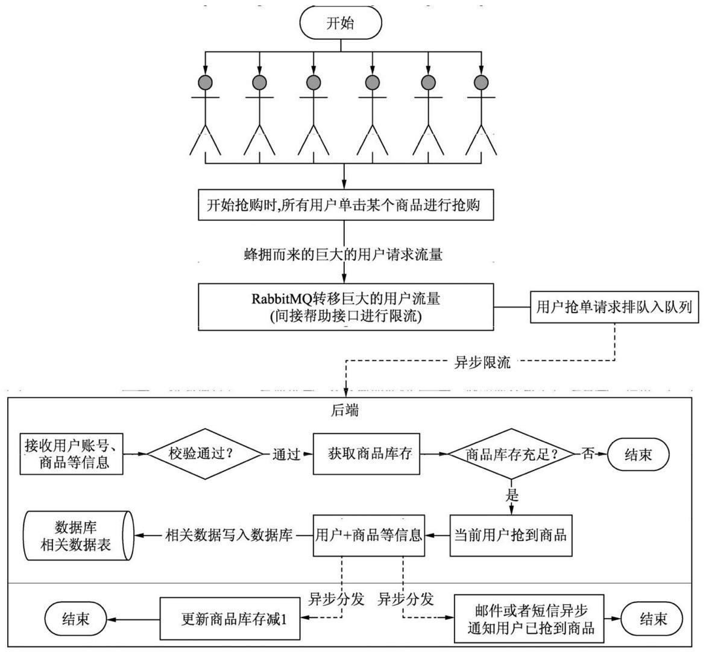
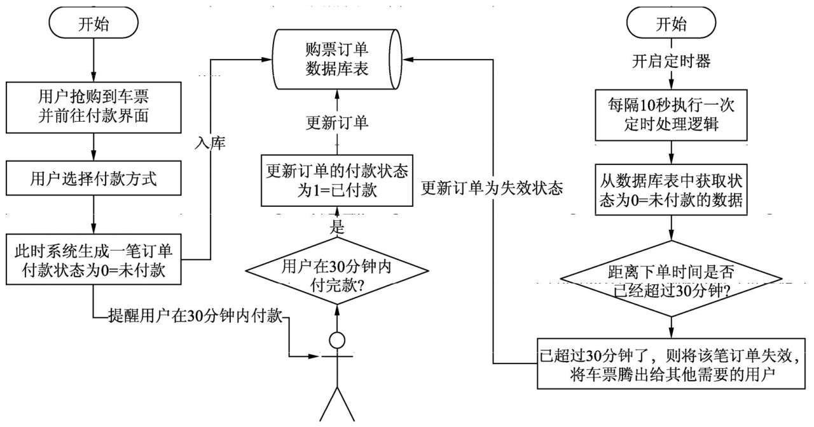
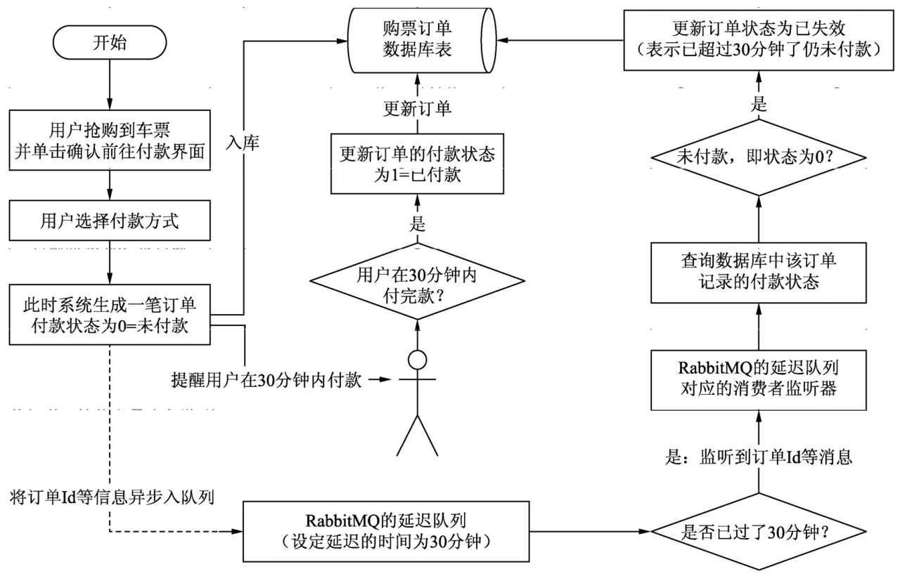
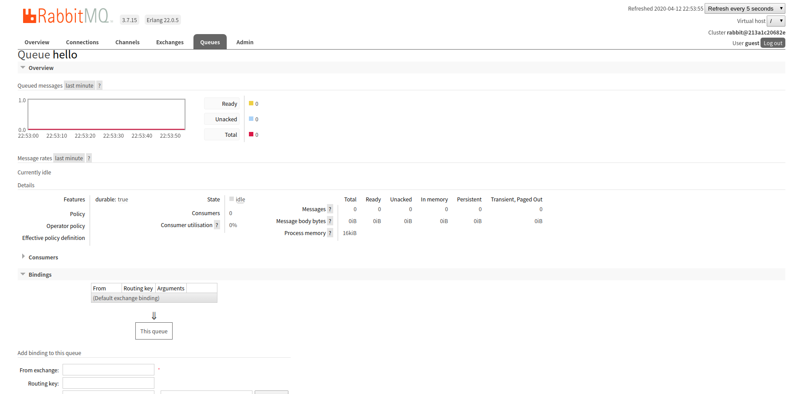

# 一、消息中间件RabbitMQ

### 1、RabbitMQ介绍

- RabbitMQ是一个开源并实现了高级消息队列协议(AMQP)的消息中间件，支持单一节点部署，也支持多个节点的集群部署。
- RabbitMQ提供了后端管理控制台，用来实现RabbitMQ的队列，交换机，路由，消息和服务节点的管理。
- RabbitMQ可以通过客户端管理相应的用户，主要是分配相应的操作权限和数据管理权限

### 2、RabbitMQ应用场景

RabbitMQ实现了高性能存储分发消息的分布式中间件，它的作用如下图

#### 2.1、异步通信和服务解耦

##### 1、以用户注册为场景，传统的方式用户注册过程如下

- 分析用户注册流程，核心业务就是判断用户注册信息的合法性以及把用户信息写入到数据库。
- 发送邮件，短信验证码服务不归属用户注册的核心流程，可以使用消息中间件进行异步通信，将这一块解耦出来。

##### 2、引入RabbitMQ消息中间件后用户注册的流程

##### 3、好处

- 引入RabbitMQ，可以将一条业务线走到底，系统的接口的整体响应时间明显降低，实现了低延迟，给用户带啦很好的体验效果。

#### 2.2、接口限流和消息分发

##### 1、以电商网站商品抢购活动的传统处理流程

- 分析抢购活动开始的那一刻，将会产生巨大的用户抢购流量，请求几乎在同一时刻到达后端系统接口。
- 首先校验用户和商品信息的合法性，校验通过后
- 会判断当前商品的库存是否重组，如果充足，代表当前用户将能成功抢购
- 最后将用户抢购成功的相关数据保存到数据库
- 异步通知用户抢购成功，尽快进行付款

分析发现后端接口在处理用户抢购整体业务流程太长，业务处理逻辑，先取出库存然后进行判断，然后进行减1更新。在高并发情况下，会导致商品超卖，数据不一致，用户等待时间过长，系统接口直接挂了，如果是商品抢购，商品秒杀等某一时刻产生高并发的请求就不行了。

##### 2、引入RabbitMQ的商品抢购流程

- 引入RabbitMQ主要用来优化系统如下：
  - 接口限流：当前端产生高并发请求的时候，不会立刻到达后端接口，而是先将请求按照先来后到加入到RabbitMQ队列，一定程度上实现接口限流。
  - 消息异步分发：当商品库存充足，当前抢购的用户将可以抢到商品，然后会异步发送短信通知用户抢购成功，然后告知用户付款，一定程度上实现消息异步分发。

#### 2.3、业务延迟处理

##### 1、实际场景分析

- 以12306抢票来分析，春运的时候12306抢票抢到车票的时候，12306会提醒用户，请在30分钟内付款。
- 正常情况用户会立刻付款，然后付款成功12306会发短信通知。
- 然而也存在一些特殊情况，比如抢到车票的用户迟迟没有付款，过了30分钟，系统会自动取消这笔订单。
- 需要延迟一定的时间后再进行处理的业务在实际生产环境常见。

##### 2、传统处理方式-采用定时器

- 传统处理方式采用一个定时器定时的去获取用户没有付款的订单，然后判断用户的下单时间距离当前时间是否超过30分钟，超过没有付款则设置订单失效。

  

  - 分析发现，春运抢票可以看做是一个大数据量，高并发请求场景，如果定时器频繁的从数据库获取未付款状态的订单，数据量非常大，假如有大量用户在30分钟内没付款，那么数据库中获取数据量一直增长，达到一定程度，给数据库服务器和应用服务器带来巨大的压力，直接压跨服务器，导致抢票全线崩溃。
  - 早期12306网站每次赶上春运，经常出现网站崩溃卡顿无响应等状态，因为某一时刻产生高并发，定时频繁拉取数据库得到数据量过大，导致内存，CPU，网络和数据库服务负载过高导致的。

##### 2、引入RabbitMQ优化

	

- 优化流程看出，RabbitMQ的引入主要替代传统处理流程的定时器处理逻辑，而采用RabbitMQ的延迟队列来进行处理。
- 延迟队列：可以延迟一定的时间后再处理相应的业务逻辑
- 常见的成功抢到票30分钟没付款流程，商城抢购没有在规定时间付款，点外卖下单成功后，没有在规定时间付款的流程，都是用RabbitMQ的延迟队列来实现。

### 3、RabbitMQ的简单使用

- 由于我本地使用docker来运行RabbitMQ，如何使用docker安装RabbitMQ以及运行，[请点击链接看我这篇博客](https://victorblog.github.io/2018/09/03/Linux%E5%AE%89%E8%A3%85%E5%B8%B8%E7%94%A8%E8%BD%AF%E4%BB%B6/#1%E3%80%81docker%E4%B8%8B%E7%9A%84RabbitMQ%E6%8B%89%E5%8F%96)

- 运行好RabbitMQ后，然后浏览器输入访问地址(http://localhost:15672/)

- 默认用户名密码都为guest/guest，即可进入RabbitMQ管理后台

  

