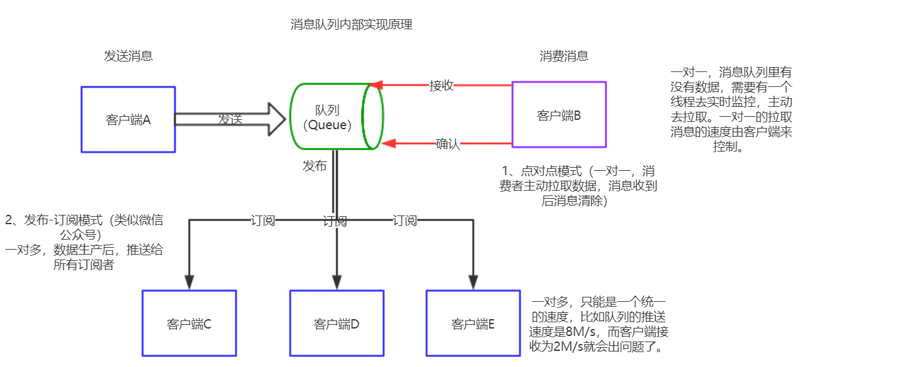
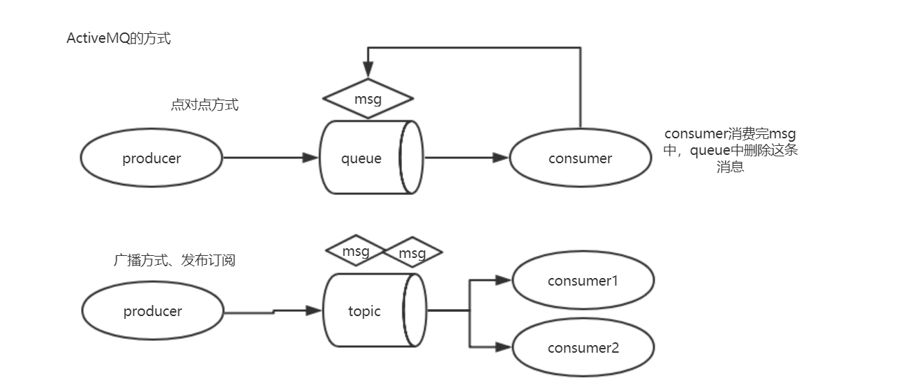
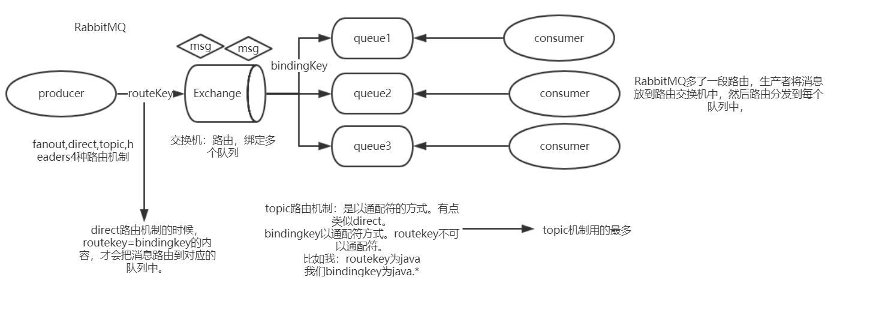
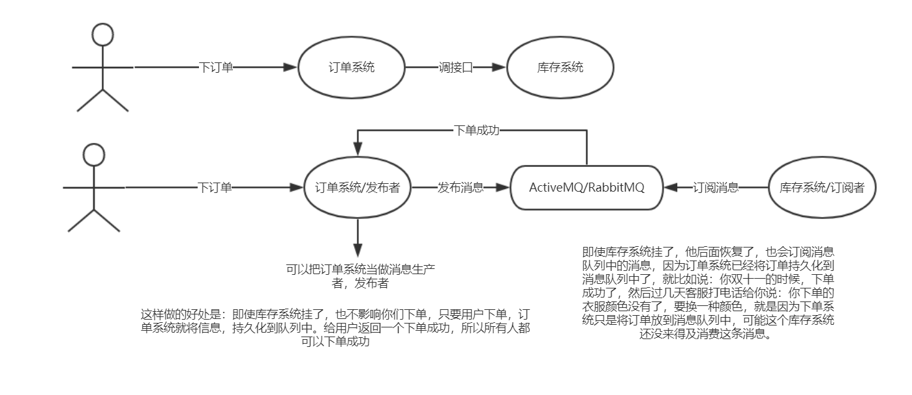
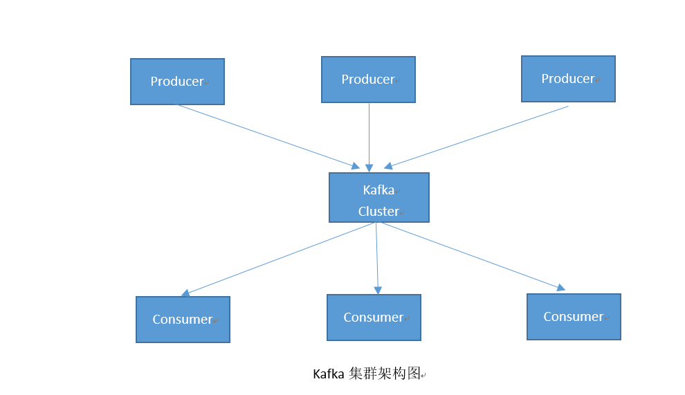
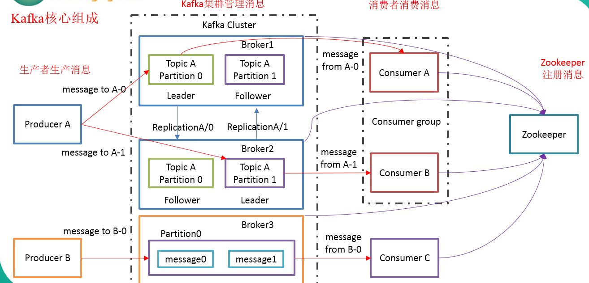

## 大数据技术之Kafka

### 1、Kafka概述

#### 1.1、消息队列

#### 1.2、为什么要用消息队列？

- **解耦**：也即是客户端A跟B不用直连，通过中间件。达到解耦
- **冗余**：消息队列可以进行数据备份，它本身可以缓冲数据
- **扩展性**：消息队列可以进行集群
- **灵活性&峰值处理能力**：机器扩展多了，峰值处理能力自然提高
- **可恢复性**：因为你数据可备份的，消息丢了一个，可以恢复的
- **顺序保证**：队列先进先出，它有顺序。
- **缓冲**：均衡两边的速度，这边数据冗余了。可以进行备份缓冲。
- **异步通信**：比如你A挂了，并不会影响B

#### 1.3三种消息队列对比：

##### 1.3.1、ActiveMQ，RabbitMQ，Kafka

- **ActiveMQ中，消费者消费完消息后，队列Queue中，这条消息立即被删除**。

  而ActiveMQ，它的队列是存在内存中。普通的消息队列是存在队列Queue中，然后存在内存中。Kafka是持久化到磁盘中，Kafka是以partition为单位进行消费的，而普通消息队列是一条一条进行消费的。

- RabbitMQ多了一段Exchange，路由交换机。有4中工作机制。**

  

  ​	当producer生产了3条消息，每个队列中不会都拿到这3条消息的，它是根据路由机制进行匹配的，有4中路由机制，fanout，direct，topic，headers。4种路由机制。

​	topic是以点为分隔符进行通配，*是匹配一个单词，#是匹配多个单词。

- **Kafka，当消费者消费完消息后，不会被立即删除，它有避免重复消费，和避免内存溢出**，Kafka是以文件的方式进行存储的，存储在磁盘中，所以永远不会内存溢出。可能会存在磁盘满了，磁盘满了，可以加集群，然后进行备份，就是partition可以备份到另一台机器中。在kafka中是以zookeeper来管理集群的。

  **kafka消费是以partition为单位进行消费的。**所以所，kafka适合数据量更大的时候的处理。

  而RabbitMQ它的消息存在内存中，如果消息超过长度，就会内存溢出。而kafka不会，消息存在磁盘中。

##### 1.3.2、ActiveMQ，RabbitMQ，Kafka应用场景

​	

或者你这个库存当时没有了，可以调用别的地方的库存，然后重新分配库存。但是kafka就没有这样的好处。

订单太多，可能会导致内存溢出，RabbitMQ中有一个partition是网络分区，用来做网络集群的，与kafka的partition不同，因此可以做集群部署。

#### 1.4、什么是Kafka

流式计算中，Kafka用来缓存数据，Storm通过消费Kafka的数据进行计算。

- Apache Kafka是一个开源消息系统，由**Scala**写成

- Kafka是由LinkedIn公司开发

- Kafka是一个**分布式消息队列**，kafka对消息保存时根据**Topic**进行归类，发送消息者叫**Producer**

  消息接收者叫**Consumer**。此外Kafka集群有多个Kafka实例组成，每个实例(server)叫**broker**。

- 不管是kafka集群，还是consumer都依赖与**zookeeper**集群保存一些meta信息，保证系统可用性。

#### 1.5、Kafka架构

partition分区：作负载均衡用。

replication：备份。

一个消费者可以消费多个topic，**同一个组里面的消费者，不能消费同一个partition分区的数据**。但是你不同的组里面，还是可以消费同一个partition分区的数据。

Consumer A与Consumer B属于通过一个消费者组，Partition0被Consumer A消费，就不能被Consumer B消费。

zookeeper：Consumer的集群依赖的，kafka集群的构建依赖于zookeeper，消费者也需要，上次消费到哪了，也要给zookeeper存一份。

#### 1.6、kafka的专业术语

- **massage**： kafka中最基本的传递对象，有固定格式。
- **topic**： 一类消息，如page view，click行为等。
- **producer**： 产生信息的主体，可以是服务器日志信息等。
- **consumer**： 消费producer产生话题消息的主体。
- **broker**： 消息处理结点，多个broker组成kafka集群。
- **partition**： topic的物理分组，每个partition都是一个有序队列。
- **segment**： 多个大小相等的段组成了一个partition。
- **offset**： 一个连续的用于定位被追加到分区的每一个消息的序列号，最大值为64位的long大小，19位数字字符长度

