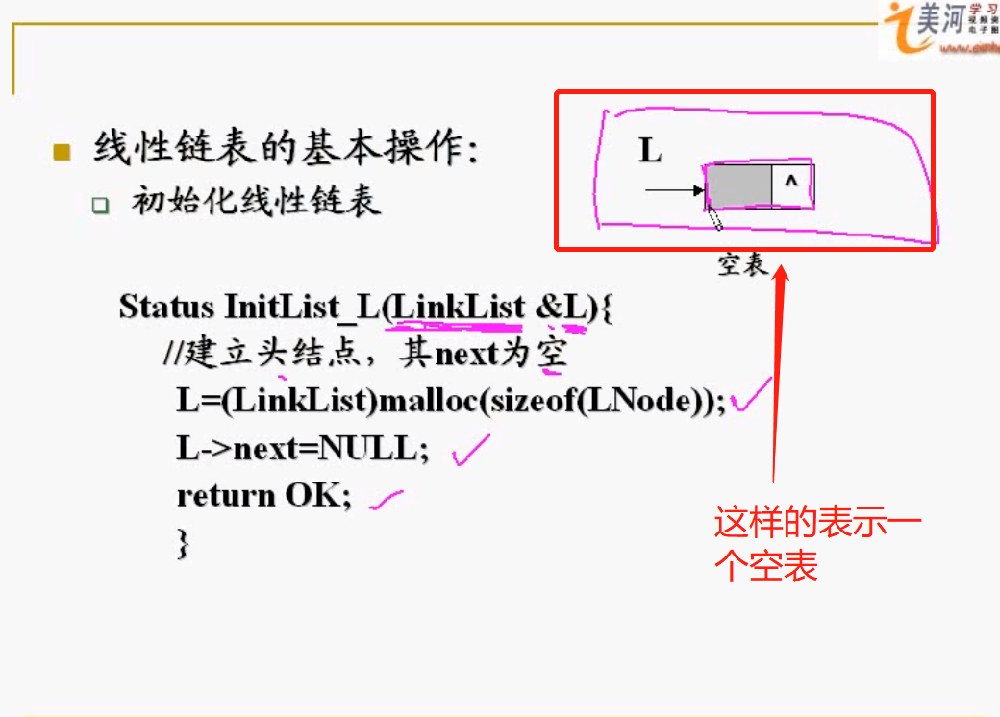

# 一、线性表

### 1、线性表的顺序存储

```c++
const LIST_INIT_SIZE=100;//表初始分配空间
const LISTINCREMENT=10;//空间分配增量
typedef struct{
    ElemType *elem;//存储空间
    int length;//当前长度
    int listsize;//当前存储容量
    int LISTINCREMENT;//可增加存储空间（可能初始分配存储空间会用完，可以增加一个10，从100变为110）
}SqList;
```

#### 1、线性表的初始化（创建一个空的线性表）

```c++
Status InitList_Sq(SqList &L){
    //构造空表L，1、首先是要申请存储空间
    L.elem=(ElemType *)malloc(LIST_INIT_SIZE*sizeof(ElemType));
    //因为申请存储空间需要系统分配，内存够用的时候才能申请到相应的存储空间
    if(!L.elem){
        exit(OVERFLOW);
    }
    //2、然后把表长度置为0
    L.length=0;
    //3、然后把初始的存储空间赋给它
    L.listsize=LIST_INIT_SIZE;
    return OK;
}//InitList_Sq
```

注意：ElemType为数据类型，比如可以为int类型。

```c++
L.elem=(int *)malloc(LIST_INIT_SIZE*sizeof(int));
```

线性表有两种结构：

- 物理结构：也就是存储结构
- 逻辑结构：也就是你定义的结构，可以为顺序结构，线性结构。

顺序存储结构：它的逻辑结构与物理结构是相同的，也就是用连续的存储单元。只需要定义一组连续的存储单元就行，然后把这个连续的存储单元的基地址，用某个变量来标注它。就比如：ElemType *elem，然后每个元素的地址系统都可以自己计算出来的。顺序存储结构，基地址知道了，就可以随机的存取。你取任何一个元素访问的时间是相同的。

在顺序存储结构中，定义的方式不仅仅是一个数组。此处定义采用的是指针的方法。因为基地址可以用一个指针来记住它。

#### 2、删除线性表中的第i个元素

```c++
Status ListDelete_Sq(SqList &L,int i,ElemType &e){
    //删除L中第i个元素，后面的元素前移
    if((i<1)||(i>L.length)){
        return ERROR;
    }
    p=&L.Elem[i-1];//p是当前这个元素的地址。
    e=*p;//*p是，p指向当前这个单元的内容，也就是i-1元素的内容放在e这个变量里
    q=L.Elem+L.length-1;//L.Elem是L的基地址,在加上L.length-1就是最后一个元素的地址，所以q其实是指向最后一个元素。
    //（q=L.Elem+L.length-1这里只是计算地址的一个过程）,p指针是指向第i-1个元素，q指针指向最后一个元素
    //从第i个元素开始到最后一个元素都往前移
    for(++p;p<=q;++p)*(p-1)=*p;//p<=q，也即是p指针在q之前。第一个++p的指针加加是，在做for语句的时候，一旦做循环p指针先加1，也就是移动到了第i个位置。在进行for的时候，仅仅执行一次。第2个++p，是每次for循环执行完之后都要再+1。
    //*(p-1)=*p;，意思是把p指针所指向的内容往前移，移到p-1。也就是元素往前移，都是用星号，目的是取元素里的内容
    --L.length;
    return OK;
}//ListDelete_Sq
```

注：第i个元素的下标是i-1，因为数组是从0开始的。

#### 3、顺序表的应用

例1、设A=(a1,a2,a3,...am),B=(b1,b2,b3,...bn)为两个线性表，试写出比较A,B大小的算法。

- 比较原则：首先去掉A,B两个集合的最大前缀子集之后，如果A,B为空，则A=B；如果A空B不空，A<B；如果B空A不空，则A>B;如果A和B均不空，则首元素大者为大。

- 分析：A,B看成是顺序表，从前往后一次比较他们两个相同下标的元素。

  ```c++
  int compare(SqList A,SqList B){
      //若A<B，返回-1，A=B返回0，A>B返回1
      int j=0;
      while(i<A.length&&j<B.length){
          if(A.elem[j]<B.elem[j])return -1;
          else if(A.elem[j]>B.elem[j])return 1;
          else j++;
      }
      if(A.length==B.length)reutrn 0;
      else if(A.length<B.length)return -1;
      else return 1;
  }
  ```

例2、设计一个算法，用尽可能少的辅助空间将顺序表中前m个元素和后n个元素进行整体互换。即将线性表,也就是O(m+n)空间复杂度

(a1,a2,...am,b1,b2,...,bn)----->(b1,b2,....,bn,a1,a2,...,am)

如果两两交换的话，要考虑m，n的大小。

- 参考算法1：取一个临时空间，将b1放入临时空间，

  把a1到am看成一个整体搬迁后移一个位置，如此b2,b3,直到bn。

  ```c++
  void exchange(SqList &L,int m,int n){
      //线性表分成两个部分后，两部分倒置
      for(int i=0;i<n;i++){//第一个for把b1到bn一个个放到临时存储空间w
          int w=L.Elem[i+m];//i+m=0+m也即是b1的下标
          for(j=m;j>=1;j--)
              L.Elem[i+j]=L.Elem[i+j-1];//然后把a1到am元素整体往后移动一个位置。
          L.Elem[i]=w;
      }
  }
  算法特点：牺牲时间节省空间，时间复杂度O(m*n)
  ```

- 参考算法2：如果另外申请空间m+n个存储单元，将b，a分别写入，时间复杂度将为m+n,也就是：牺牲空间节省时间。

  ```c++
  void exchange(SqList &L,int m,int n){
     SqList List;//为m+n长度
      //存放b1,b2,...bn
      for(int i=0;i<n;i++){
          List.Elem[i]=L.Elem[i];
      }
      //存放a1,a2,am
      for(int i=m;i<=L.length-1;i++){
          List.Elem[i]=L.Elem[i];
      }
  }
  ```

### 2、线性链表的表示、实现、操作

- 顺序表的局限：插入、删除时要移动大量的元素，耗费大量时间。

- 链式表示：用一组**任意**的存储单元存储线性表
  - 存储单元不要求连续：物理结构不反应逻辑结构
  - 不可以随机存取，但插入和删除方便
  - 需要两个域：一个表示数据本身；一个表示数据元素间的先后关联。合起来是一个**结点**。
  - S结点中表示关联的部分为**指针域**，内部存放指针或者链。结点链接成一个**链表**。

### 2、线性链表的表示、实现、操作

### 3、循环链表的定义

#### 1、线性链表（单链表）的定义：

```c++
typedef struct LNode{
    ElemType data;
    struct LNode *next;//指针域指向的是下一个结点，它指向的自然也就是结点类型。
}LNode,*LinkList//这个LinkList是一个指针
```

带头结点的单链表：头结点：data里没有数据。比如把表里元素都删除。总不能只剩下一个L吧。头结点的增加仅仅是为了运算的方便。做题的时候，要看清楚是不是带头结点的链表，默认都是带头结点的链表。

#### 2、线性表的基本操作：

##### 1、初始化线性链表

也就是创建一个仅仅有头结点的空表。



```c++
Status InitList_L(LinkList &L){//LinkList，就是刚刚在struct结构体定义的*LinkList
    //建立头结点，其next为空
    L=(LinkList)malloc(sizeof(LNode));
    L->next=NULL;
    return OK;    
}
```

##### 2、GetElem在单链表中的实现GetElem_L(L,i,&e)

也就是把第i个元素取出来，赋给变量e。

思想：可以使用一个指针p指向第一个元素，然后再用一个计数器flag=1。

或者让指针p指向头结点，可以把计数器flag=0；然后指针不断的往后，计数器flag要不断的+1。

```c++
Status GetElem_L(LinkList L,int i,ElemType &e){//使用&e，是因为e的值会发生变化。因为把获取到的值，赋给了e。
    //L为带头结点的单链表的头指针
    //当第i个元素存在时，将值返回给e，OK,否则ERROR
    LNode *p=L->next;//L->next指向第一个元素，相当于是p指向第一个元素
    int flag=1;
    while(p&&flag<i){//while条件中的p，p是不为空的意思。因为p是一个指针，while(p)表示，p指针存在，也就是p指向的元素是存在的，并且flag是小于i的
        p=p->next;//那么我就把p->next赋给p，也就是p指针后移
        ++flag;
    }
    if(!p||flag>i)return ERROR;//比如可能有这种情况，链表只有5个元素，但是i给你的是6，这时候也就是p不存在了，自然就是error了
    e=p->data;
    return OK;      
}//GetElem_L
```

注：顺序表与单链表在取第i个元素的操作上有什么不同？

顺序表：随机存取

##### 3、插入操作：在第i个结点之前插入一个元素e

```c++
Status ListInsert_L(LinkList &L,int i,ElemType e){
    //在线性表的第i个元素之前插入一个元素e
    p=(LinkList)malloc(sizeof(LNode));
    if(!p)exit(OVERFLOW);
    p->data=e;
    q=L;
    flag=0;
    while(q&&flag<i-1){
        q=q->next;
        ++flag;
    }
    if(!q||flag>i-1)return ERROR;
    P->next=q->next;
    q->next=p;
    return OK;
}//ListInsert_L
时间复杂度分析：O(n)
```

总结：只要是把值赋给e的操作，都是要用Elem &e，如果只是单纯把e赋给别的，就用Elem e好了。

```c++
LNode* LocateElem_L(LinkList L,ElemType e){
    //在L中找到第一个值和e相同的结点，返回其地址，若不存在，返回空值
    if(!L)return NULL;
    p=L;
    while(p&&p->data!=e)p=p->next;//只有当!p也就是p不存在，或者是p->data=e才循环结束。也就是返回p。
    return p;
}
时间复杂度为O(n)
```

例题1：将两个有序链表归并为一个新的有序链表。

分析：将Lb中的元素插入到La，使其有序。

pa->data >pb->data:将pb插入到pa的前面。插入过程中，注意临时指针的使用。

声明两个指针，pa指向La的第一个元素，pb指向Lb的第一个元素。

还要额外增加两个辅助变量来记录。比如用p来记录pa前面那个元素。

然后用q来记录pb前面的那个元素。

```c++
void mergeList(LinkList &La,LinkList &Lb){
    //归并两个非递减单链表La，Lb，形成新的La
    pa=La->next;
    pb=Lb->next;
    p=La;//p其实就是pb的前面那个元素,是一个存储单元
    while(pa&&pb){//当pa存在，并且pb存在
        if(pa->data<=pb->data){//如果pa的data域小于pb的data域，让p和pa存在先后关系。就是说把pa赋给p，pa赋给pa的下一个。
            p=pa;
            pa=pa->next;
        }
        else{//否则就要插入了。
            t=pb;//让t来存pb的前面那个元素
            pb=pb->next;
            /*
            以下三句是做插入操作。因为pb的data比pa大，所以前插入，因为此				时的pa已经是next了所以先连后面的，用t->next连到pa，然后p是pa前			一个元素，则p的next指针域连到t。然后再把p移动到t的位置，因为此时			t的位置是新插入的元素，你原来的元素已经不是p的位置了，此时新插入			 的元素在pa之前。总之，始终要保证p在pa的前一个元素。
            */
            t->next=pa;
            p->next=t;
            p=t;
        }
        if(pb)
           //如果此时pa=La->next已经为NULL不存在了那就直接把pb插到pa的后面
           p->next=pb;
    }
}
时间复杂度为O(n)
```

### 4、双向循环链表的定义、操作	

### 5、线性表的典型应用

# 二、栈和队列

### 1、栈的抽象数据类型

- 栈：一个只能在栈顶进行插入和删除的线性表，其特征为FIFO。

- 栈的表示：

  - 顺序栈：栈的顺序存储
    - 优点：处理方便
    - 缺点：数组大小固定，容易造成内存资源的浪费。

  - 链栈：栈的动态存储
    - 优点：能动态改变链表的长度，有效利用内存资源
    - 缺点：处理较为复杂

#### 1.1、顺序栈的表示和实现

```c++
#define STACK_INIT_SIZE 100;
#define STACKINCREMENT 10;//可增长的长度。当100个存储空间用完以后，可增加。
typedef struct{
    SElemType *base;//base表示将要申请的这一组存储空间的基地址。
    SElemType *top;
    int stacksize;
}SqStack;
/**
stacksize:表示栈当前可以使用的最大容量。
base:栈底
top：栈顶
栈顶指针指向栈顶元素的下一个位置。也就是下次压栈时元素所放的位置。
*/
top指向的是下一个元素将要存放的位置。
top减一指向弹栈时下一个元素的取值位置。
栈空的条件：top=base;
栈满的条件：top-base>=stacksize;
因为每次top都是指向栈顶元素的下一个位置。那么出栈的时候，top先-1，然后到了栈顶元素。
```

```c++
//初始化栈
Status InitStack(SqStack &S){//这里使用&S，是因为S发生变化，因为给S申请存储空间了。
    //构造一个空栈
    //1、首先申请一块连续的存储空间，base地址是你申请存储空间的时候，系统给的地址。
    S.base=(SElemType *)malloc(STACK_INIT_SIZE*sizeof(SElemType));
    if(!S.base)exit(OVERFLOW);
    //2、初始化的空栈的时候，top指针等于base指针。
    S.top=S.base;
    //3、初始化栈的大小
    S.stacksize=STACK_INIT_SIZE;
    return OK;
}//InitStack
```

```c
//压栈
Status Push(SqStack &S,SElemType e){//这里使用&S，因为要插入e到栈S里，S发生变化了，所以要用&，e不用加&是因为，e只是插入，并没有给e赋值，而让e发生变化
    //元素e插入到栈中S
    if(S.top-S.base>=S.stacksize)//栈满
    {
        newbase=(SElemType *)realloc(S.base,(S.stacksize+STACKINCREMENT)*sizeof(SElemType));//重新申请存储空间
  		if(!newbase)exit(OVERFLOW);//如果不能申请
        else S.base=newbase;//可以申请则把新的基地址赋给原来的base
        S.top=S.base+S.stacksize;
        S.stacksize+=STACKINCREMENT;                             
    }//if
    *S.top++=e;//因为top永远指向栈顶元素的下一个。这个等价于*S.top=e，然后S.top++;
    return OK;                                 
}//Push

```

```c
//出栈
Status Pop(SqStack &S,SElemType &e){
    //因为出栈，然后再把元素赋值给e，e发生变化了，所以要用&e
    //从栈顶读取数据放入e内，栈中下一元素所在位置成为新的栈顶
    if(S.top==S.base)return ERROR;//栈空
    e=*--S.top;//因为top栈顶指针永远指向栈顶元素的下一个位置，所以出栈的时候，你要先进行减1，到栈顶位置，然后再取栈顶元素的数据。然后赋值给e
    return OK;
}

```

注：top的操作顺序和值的变化

压栈：value->top;top++;//首先是把值赋给top后，然后top再++,指向当前压栈元素的下一个

弹栈：top--;top->value;//首先是top先--，指向栈顶元素，然后再取值。

#### 1.2、链栈的结构和表示

```c
//定义栈结构
typedef struc stack_node{
    ElemType data;
    struct stack_node *next;
}LinkStack*;
LinkStack stk;//stk标识这个栈的栈顶元素，也就是头指针，标识栈顶的作用，所以并不需要定义一个top指针。
//栈底：最先入栈的

```

```C
//入栈push
Status Push(LinkStack &stk,ElemType x){//stk表示这个栈的栈顶元素也就是头指针。标识栈顶位置的作用。
    LinkStack top;//此处top无任何意义，只是一个标识，用p，q都可以，仅仅是一个即将要入栈的x的存储空间而已，是一个过渡的辅助变量而已。因为我们已经用stk表示这个栈了，也就是说stk标识这个栈的栈顶元素的位置了。起到了标识栈顶位置的作用。
    //我要插入x，肯定要给x申请存储空间，因为top是指向当前x元素的
    top=malloc(sizeof(LinkStack));
    top->data=x;
    //自然要把top->next连接到stk上，指向栈顶指针。
    top->next=*stk;
    //然后此时栈顶元素的指针就不是stk了，而是刚刚入栈的元素了。也就是把top赋给stk成为新的栈顶指针。
    *stk=top;
}

```

```c
//出栈：相当于把单链表的表头元素给删除掉
Status Pop(LinkStack &stk,ElemType &e){//因为pop之后，你栈顶元素出来之后，stk变化了，所以我们要在stk变量前面加上一个&字符。因为pop出来这个元素后，赋值给e这个变量，e也发生变化了，所有也加上&
    LinkStack p=stk;//用临时指针p先记住stk的位置
    p=p->next;
    free(p);//这些是不带头结点的操作。
    //如果是带头结点的话，stk指向的是表头一个空的，stk->next才是指向真正的栈顶元素。
}

```

### 2、队列

```c++
//初始化空队列Q
InitQueue(&Q);
//Q为空则true
QueueEmpty(Q);
//入队，x加入，成为Q的新队尾
EnQueue(&Q,x);
//出队，删除队头元素，然后把对头元素赋给x
DeQueue(&Q,&x);
GetHead(Q,&x)

```

#### 2.1、顺序队列

```c++
#define MaxSize 50
typedef struct Node{
    ElemType data[MaxSize];
    int front,rear;
}SqQueue;
//队空条件：
Q.front==Q.rear==0;

```

#### 2.2、循环队列

```c++
初始：Q.front=Q.rear=0;
队首指针进1：Q.front=(Q.front+1)%MaxSize;
队尾指针进1：Q.rear=(Q.rear+1)%MaxSize;
队列长度：(Q.rear+MaxSize-Q.front)%MaxSize;
队满条件：(Q.rear+1)%MaxSize==Q.front;

```

- 队列初始化

  ```c++
  void InitQueue(&Q){
      Q.rear=Q.front=0;//初始化队首、队尾指针
  }
  
  ```

- 判队空

  ```c++
  bool isEmpty(Q){
      if(Q.rear==Q.front)return true;
      else return false;
  }
  
  ```

- 入队

  ```c++
  bool EnQueue(SqQueue &Q,ElemType x){
      if((Q.rear+1)%MaxSize==Q.front)return false;//队满
      Q.data[Q.rear]=x;
      //入队从队尾
      Q.rear=(Q.rear+1)%MaxSize;//队尾指针加1
      return true;
  }
  
  ```

- 出队

  ```c++
  bool DeQueue(SqQueue &Q,ElemType &x){
      if(Q.rear==Q.front)return false;//出队之前，先判断队是否为空
      x=Q.data[Q.front];
      //出队从队头开始
      Q.front=(Q.front+1)%MaxSize;//队头指针加1取模
      return true;
  }
  
  ```

#### 2.3、链式队列

```c++
//结点定义
typedef struct Node{
    ElemType data;
    struct LinNode *next;
}LinkNode;
typedef struct Q{
    LinkNode *front,*rear;
}LinkQueue;

```

- 初始化

  ```c++
  void InitQueue(LinkQueue &Q){
      Q.front=Q.rear=(LinkNode*)malloc(sizeof(LinkNode));//建立头结点
      Q.front->next=NULL;
  }
  
  ```

- 判队空

  ```c++
  bool isEmpty(LinQueue Q){
      if(Q,front==Q.rear)return true;
      else return false;
  }
  
  ```

- 入队

  ```c++
  void EnQueue(LinkQueue &Q,ElemType x){
      s=(LinkNode *)malloc(sizeof(LinkNode));
      s->data=x;
      s->next=NULL;
      Q.rear->next=s;//将新节点插入到队尾
      Q.rear=s;//队尾指针移动到新的结点s
  }
  
  ```

- 出队

  ```c++
  bool DeQueue(LinkQueue &Q,ElemType &x){
      if(Q.front==Q.rear)return false;//空队
      p=Q.front->next;//因为有头结点，所以对头应该是next，然后给p临时变量
      x=p->data;
      Q.front->next=p->next;//然后让头结点，指向头结点的下一个结点。
      if(Q.rear==p)Q.rear=Q.front;//如果队列中只有一个结点，则队头等于队尾，为空了。
      free(p);
      return true;
  }
  
  ```

# 三、二叉树

```c++
//二叉树的链式存储结构
typedef struct BiTNode{
    ElemType data;
    struct BiTNode *lchild,*rchild;
}BiTNode,*BiTree;
//先序遍历
void PreOrder(BiTree T){
    if(T!=NULL){
        visit(T);
        PreOrder(T->lchild);
        PreOrder(T->rchild);
    }
}
//中序遍历
void InOrder(BiTree T){
    if(T!=NULL){
        InOrder(T->lchild);
        visit(T);
        InOrder(T->rchild);
    }
}
//后续遍历
void PostOrder(BiTree T){
    if(T!=NULL){
        PostOrder(T->lchild);
        PostOrder(T->rchild);
        visit(T);
    }
}
//层次遍历
void LevelOrder(BiTree T){
    InitQueue(Q);
    BiTree p;//p是遍历指针
    EnQueue(Q,T);//将根结点入队
    while(!isEmpty(Q)){//队列不空
        DeQueue(Q,p);//队头元素出队
        visit(p);//访问当前p所指向的结点
        if(p->lchild!=NULL)
            EnQueue(Q,p->lchild);
        if(p->rchild!=NULL)
            EnQueue(Q,p->rchild);
    }
}

```

# 四、图

- 连通：在无向图中，从顶点v到顶点w有路径存在

- 连通图：图中任意两个顶点都是连通的。

- 连通分量：无向图中的极大连通子图，极大也就是要包含所有的边。

- 极小连通子图：既要保证图连通，也要保证边数最少。

- 强连通：有向图，顶点v到顶点w，与顶点w到顶点v之间都有路径。，为强连通的。

- 强连通图：邮箱途中，任意一对顶点都是连通的。
- 边权：图的每条边标上数值，数值为权值
- 网：带边权的图为网。

### 1、图的存储

